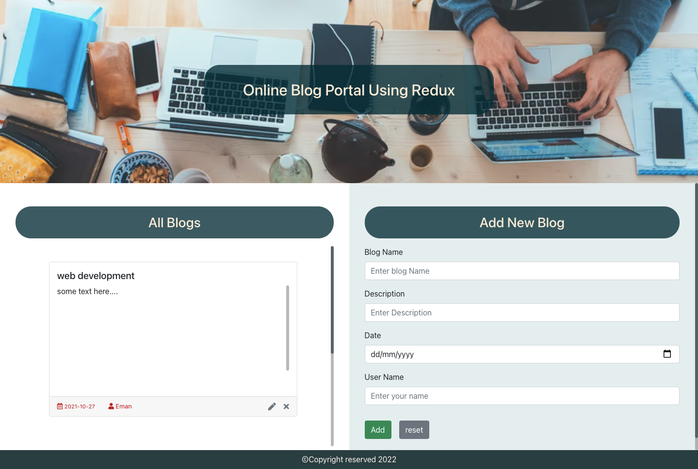

# Practice Time (Project - 3: Online Blog portal - CRUD Redux)

- Using Redux toolkit concept implement CRUD App.




<details>

  <summary>blog-app structure (React Redux)</summary>


As you can see there is an Action folder and a Reducers folder that are separated, which makes the code more complex but now with the redux toolkit, we can just create the slice which then takes care of everything.

</details>


<details>

  <summary>blog-app (Redux Toolkit - recommended)</summary>


- Your app sturcture should look like this:

```
/blog-app
   /src
    /App.js
    /App.css
    /index.js
    /redux
      /app
        store.js
      /features
        /blogs
          blogsSlice.js
    /components
      /BlogsList.js
      /Blog.js
      /AddBlog.js
      /EditBlog.js
      /Footer.js
```
- Make a `forms` to Add/Edit Blogs using `React-Hook-Form`.
- Make `Add`/`Edit`/`Delete` Functionalities.

- Create react app using the command:
  ```js
  npx create-react-app@latest blog-app
  ```
- Use Redux toolkit for state managment of the app.
  - install:
  ```js
  npm install @reduxjs/toolkit react-redux
  ```
- Use `uuid` to generate an id when creating new Meal.

  - install:
  ```js
  npm install uuid
  ```
  - import:
  ```js
  import { v4 as uuidv4 } from 'uuid';
  ```
  - use:
  ```js
  id: uuidv4()
  ```

- Use `react-toastify` to add notifications to your app with ease.

  - install:
  ```js
  npm install --save react-toastify
  ```
  - In the index.js (the root component) add the import below, then call `ToastContainer` :
  ```js
     import { ToastContainer } from 'react-toastify';
     import 'react-toastify/dist/ReactToastify.css';
  ```

  ```js
  ReactDOM.render(
    <React.StrictMode>
      <App />
      <ToastContainer />
    </React.StrictMode>,
  document.getElementById('root')
  );
  ```
  
  - import:

  ```js
  import {toast } from 'react-toastify';
  ```

- Add the CDN Fontawsome icons in `index.html` into the `head` section
  ```html
    <link rel="stylesheet" href="https://use.fontawesome.com/releases/v5.15.4/css/all.css" integrity="sha384-DyZ88mC6Up2uqS4h/KRgHuoeGwBcD4Ng9SiP4dIRy0EXTlnuz47vAwmeGwVChigm" crossorigin="anonymous">

  ```

- Use react bootstrap for rapid design
  - instaltion:
    ```
    npm install react-bootstrap bootstrap
    ```
  - In the index.js (the root component) add the import below:
    ```
     import 'bootstrap/dist/css/bootstrap.min.css';
     ```

- Use React Hook Form:
  - instaltion:
  ```js
   npm install react-hook-form
  ```

### Shorthand command to install all the npm packages needed: 
```js
npm install react-bootstrap bootstrap react-hook-form uuid react-toastify @reduxjs/toolkit react-redux
```

- `index.js`

```js
import React from 'react';
import ReactDOM from 'react-dom';
import './index.css';
import App from './App';
import { Provider } from 'react-redux'
import store from './redux/app/store';
import { ToastContainer } from 'react-toastify';
import 'react-toastify/dist/ReactToastify.css';
import 'bootstrap/dist/css/bootstrap.min.css';

ReactDOM.render(
  <Provider store={store}>
    <React.StrictMode>
      <App />
      <ToastContainer />
    </React.StrictMode>
  </Provider>,
  document.getElementById('root')
);

```

- `App.js`

```js
import "./App.css";
import BlogsList from './components/BlogsList'
import Footer from "./components/Footer";

function App() {
  return (
    <div className="App">
      <div className="banner">
        <h2>Online Blog Portal Using Redux</h2>
      </div>
      <BlogsList />
      <Footer />
    </div>
  );
}
export default App;

```

- `blogsSlice.js`
```js
import { createSlice } from '@reduxjs/toolkit';
import { toast } from 'react-toastify';

const initialState = {
    blogs: [
        {
            id: "1234fff",
            blogName: "web development",
            description: "some text here....",
            postedDate: "2021-10-27",
            userName: "Eman",
            userID: "14564fff",
        },
        {
            id: "14564fff",
            blogName: "Java development",
            description: "some text here....",
            postedDate: "2021-10-25",
            userName: "Sara",
            userID: "56764fff",
        },
    ],
    blog: null
}
export const blogsSlice = createSlice({
    name: "blogs",
    initialState,
    reducers: {
        addBlog(state, { payload }) {
            //Add the new blog at the beginning of the blogs(state)
            state.blogs.unshift(payload)
            toast.success('Blog has been Added Successfully!!');
        },
        updateBlog(state, { payload }) {
            //1-make a new array of the filtered blogs (all blogs except the updated blog which is sent in the payload from the EditBlog.js)
            const filterdBlogs = state.blogs.filter((filterdBlog) => filterdBlog.id !== payload.id);
            //2- assign the filterd array to the the blogs(state) => UPDATE DONE
            state.blogs = filterdBlogs
            //3-Add the updated blog at the beginning of the blogs(state)
            state.blogs.unshift(payload)
            toast.success('Blog has been Updated Successfully!!');
        },
        removeBlog(state, { payload }) {
            //1-make a new array of the filtered blogs (all blogs except the blog's id we want to remove which is sent in the payload from the Blog.js) when the user clicked the remove/x icon on the Blog Card
            const filterdBlogs = state.blogs.filter((filterdBlog) => filterdBlog.id !== payload);
            //2- assign the filterd array to the the blogs(state) => REMOVE DONE
            state.blogs = filterdBlogs
            toast.info('Blog has been Removed Successfully!!');
        },
        selectedBlog(state, { payload }) {
            //Add the selected blog which is sent in the payload to be used by the EditBlog to get the data for the blog being updated when the user clicked the edit/pen icon on the Blog Card
            state.blog = payload;
            toast.info('A blog is being selected!');
        }
    }
})

//these the actions used in the components in the dispatch
export const { addBlog, selectedBlog, updateBlog, removeBlog } = blogsSlice.actions

//used in the components to extract the states from the store
//shortcuts here
export const selectedBlogs = state => state.blogs.blogs
export const selectedOneBlog = state => state.blogs.blog

//used in configureStore() in store/js
export default blogsSlice.reducer

```

- `store.js`
```js
import { configureStore } from "@reduxjs/toolkit";
import blogsReducer from "../features/blogs/blogsSlice";

export default configureStore({
    reducer:{
        blogs: blogsReducer
    }
})
```

- `BlogsList.js`
```js
import React, { useState } from "react";
import { useSelector } from "react-redux";
import AddBlog from "./AddBlog";
import Blog from "./Blog";
import EditBlog from "./EditBlog";
import {selectedBlogs} from '../redux/features/blogs/blogsSlice'

function BlogsList() {
  const [shouldShowEditForm, toggleShowEditForm] = useState(false);

  const blogs = useSelector(selectedBlogs);

  const handleShowEditForm = () => {
    toggleShowEditForm(!shouldShowEditForm);
  };
  return (
    <div className="main-container">
      <div className="blogs-outer-container">
        <h3>All Blogs</h3>
        <div className="blogs-inner-container">
          {blogs != "" ? (
            <>
              {blogs.map((blog) => (
                <Blog
                  key={blog.id}
                  blog={blog}
                  handleShowEditForm={handleShowEditForm}
                />
              ))}
            </>
          ) : (
            <h4 class="text-muted">No Blogs Yet</h4>
          )}
        </div>
      </div>

      <div className="forms-container">
        {shouldShowEditForm ? (
          <EditBlog handleShowEditForm={handleShowEditForm} />
        ) : (
          <AddBlog />
        )}
      </div>
    </div>
  );
}

export default BlogsList;

```

- `Blog.js`
```js
import React from "react";
import { useDispatch } from "react-redux";
import { selectedBlog, removeBlog } from "../redux/features/blogs/blogsSlice";
import Card from "react-bootstrap/Card";

function Blog({ blog, handleShowEditForm }) {
  const dispatch = useDispatch();

  const {id, blogName, description, postedDate, userName} = blog

  const handleSelectedBlog = () => {
    handleShowEditForm();
    dispatch(selectedBlog(blog));
  };

  return (
    <div>
      <Card style={{ width: "32rem", height: "20rem", margin: "2rem 0" }}>
        <Card.Body>
          <Card.Title>{blogName}</Card.Title>
          <Card.Text style={{ height: "11rem", overflowY: "scroll" , lineHeight: "1.6rem"}}>
            {description}
          </Card.Text>
        </Card.Body>
        <Card.Footer className="text-muted">
          <span>
            {" "}
            <i className="far fa-calendar-alt "></i>{" "}
            <small className="me-4">{postedDate}</small>{" "}
            <i className="fas fa-user "></i> {userName}
          </span>
          <div>
            <i
              className="fas fa-pen me-3 edit-icon"
              onClick={() => handleSelectedBlog()}
            />
            <i
              className="fas fa-times delete-icon"
              onClick={() => dispatch(removeBlog(id))}
            />
          </div>
        </Card.Footer>
      </Card>
    </div>
  );
}

export default Blog;

```

- `AddBlog.js`
```js
import React from "react";
import { useDispatch } from "react-redux";
import { addBlog } from "../redux/features/blogs/blogsSlice";
import { v4 as uuidv4 } from "uuid";
import Form from "react-bootstrap/Form";
import Button from "react-bootstrap/Button";
import { useForm } from 'react-hook-form'

export default function AddBlog() {

  const { register, handleSubmit, formState: { errors } } = useForm({
    mode: "onBlur"
  })

  const dispatch = useDispatch();

  const onSubmit = (data) => {

    let newBlog = {
      id: uuidv4(),
      userID: uuidv4(),
      ...data
    }
    dispatch(addBlog(newBlog));

  };

  return (
    <div>
      <Form onSubmit={handleSubmit(onSubmit)}>
        <h3 className="mb-3">Add New Blog</h3>
        <Form.Group className="mb-3">
          <Form.Label>Blog Name </Form.Label>{" "}
          <Form.Control
            type="text"
            placeholder="Enter blog Name "
            {...register("blogName", {
              required: "Blog Name is required"
            })}
          />
          <span>{errors.blogName?.message}</span>
        </Form.Group>

        <Form.Group className="mb-3">
          <Form.Label>Description</Form.Label>{" "}
          <Form.Control
            type="text"
            placeholder="Enter Description"
            {...register("description", {
              required: "Description is required"
            })}
          />
          <span>{errors.description?.message}</span>
        </Form.Group>

        <Form.Group className="mb-3">
          <Form.Label>Date</Form.Label>{" "}
          <Form.Control
            type="date"
            placeholder="Enter your name"
            {...register("postedDate", {
              required: "Date is required"
            })}
          />
          <span>{errors.postedDate?.message}</span>

        </Form.Group>

        <Form.Group className="mb-3">
          <Form.Label>User Name</Form.Label>{" "}
          <Form.Control
            type="text"
            placeholder="Enter your name"
            {...register("userName", {
              required: "User Name is required"
            })}
          />
          <span>{errors.userName?.message}</span>
        </Form.Group>

        <Button variant="success" type="submit" className="mt-3 me-3">
          Add
        </Button>
        <Button variant="secondary" className="mt-3 me-3" type="reset">
          reset
        </Button>
      </Form>
    </div>
  );
}

```

- `EditBlog.js`
```js
import React from "react";
import { useDispatch, useSelector } from "react-redux";
import { updateBlog, selectedOneBlog } from "../redux/features/blogs/blogsSlice";
import Form from "react-bootstrap/Form";
import Button from "react-bootstrap/Button";
import {useForm} from 'react-hook-form'


export default function EditBlog({ handleShowEditForm }) {
  const blog = useSelector(selectedOneBlog);

  const {register, handleSubmit, formState: {errors}} = useForm({
    mode: "onBlur",
    defaultValues:{
      blogName: blog.blogName,
      description: blog.description,
      postedDate: blog.postedDate,
      userName: blog.userName
    }
  })

  const dispatch = useDispatch();

  const onSubmit = (data) => {

    let updatedBlog = {
      id: blog.id,
      userID: blog.userID,
      ...data
    }
    dispatch(updateBlog(updatedBlog));
    handleShowEditForm();
  };

  return (
    <div>
      <Form onSubmit={handleSubmit(onSubmit)}>
        <h3 className="mb-3">Update Blog</h3>
        <Form.Group className="mb-3">
          <Form.Label>Blog Name </Form.Label>{" "}
          <Form.Control
            type="text"
            placeholder="Enter blog Name "
            {...register("blogName", {
              required: "Blog Name is required"
            })}
          />
          <span>{errors.blogName?.message}</span>
        </Form.Group>

        <Form.Group className="mb-3">
          <Form.Label>Description</Form.Label>{" "}
          <Form.Control
            type="text"
            placeholder="Enter Description"
            {...register("description", {
              required: "Description is required"
            })}
          />
           <span>{errors.description?.message}</span>
        </Form.Group>

        <Form.Group className="mb-3">
          <Form.Label>Date</Form.Label>{" "}
          <Form.Control
            type="date"
            placeholder="Enter your name"
            {...register("postedDate", {
              required: "Date is required"
            })}
          />
            <span>{errors.postedDate?.message}</span>

        </Form.Group>

        <Form.Group className="mb-3">
          <Form.Label>User Name</Form.Label>{" "}
          <Form.Control
            type="text"
            placeholder="Enter your name"
            {...register("userName", {
              required: "User Name is required"
            })}
          />
          <span>{errors.userName?.message}</span>
        </Form.Group>

        <Button variant="success" type="submit" className="mt-3 me-3">
          Update
        </Button>
        <Button variant="secondary" className="mt-3 me-3" onClick={() => handleShowEditForm()}>
          Cancel
        </Button>
      </Form>

       
    </div>
  );
}

```
- `Footer.js`
```js
import React from "react";

export default function Footer() {
  return (
    <footer className="footer">
      <div className="footerContainer">
        <p>ⒸCopyright reserved 2022</p>
      </div>
    </footer>
  );
}

```

- `App.css`
```css
.banner {
  background-image: url("https://images.unsplash.com/photo-1519389950473-47ba0277781c?ixid=MnwxMjA3fDB8MHxwaG90by1wYWdlfHx8fGVufDB8fHx8&ixlib=rb-1.2.1&auto=format&fit=crop&w=870&q=80");
  height: 55vh;
  background-repeat: no-repeat;
  background-size: cover;
  display: flex;
  flex-direction: column;
  justify-content: center;
  align-items: center;
}

h2 {
  background-color: rgba(2, 42, 52, 0.776);
  padding: 2rem 5rem;
  color: antiquewhite;
  border-radius: 2rem;
}

.main-container,
.text-muted {
  display: flex;
  flex-direction: row;
  justify-content: space-between;
  align-items: center;
}

.blogs-outer-container {
  background-color: rgb(229, 238, 238);
  width: 50vw;
  height: 80vh;
  padding: 3em 2em;
}

.blogs-outer-container,
.forms-container {
  background-color: rgb(229, 238, 238);
  width: 50vw;
  height: 80vh;
  padding: 3em 2em;
}
.forms-container {
  overflow-y: auto;
}
.blogs-outer-container {
  background-color: rgb(255, 255, 255);
}

.main-container h3 {
  background-color: rgba(2, 42, 52, 0.776);
  padding: 1rem;
  color: antiquewhite;
  border-radius: 2rem;
  text-align: center;
  margin-bottom: 1rem;
}

.blogs-inner-container {
  display: flex;
  flex-direction: column;
  justify-content: space-between;
  align-items: center;
  height: 60vh;
  overflow-y: scroll;
}
span {
  color: rgb(184, 19, 19);
  font-size: small;
  text-align: left;
}

.edit-icon:hover {
  color: rgb(14, 102, 255);
}

.delete-icon:hover {
  color: rgb(255, 38, 14);
}

.footer {
  display: grid;
  place-items: center;
  background-color: rgba(40, 61, 63, 0.995);
  color: rgb(255, 243, 243);
  padding: 1rem;
}

.footerContainer {
  display: flex;
  flex-direction: column;
  justify-content: center;
  align-items: center;
  height: 1vh;
}

.footerContainer p {
  margin: 0;
}

::-webkit-scrollbar{
  width: 6px;
  height: 8px;
}
::-webkit-scrollbar-track {
  background: #807c7c8a;
  border-radius: 10px;
}
::-webkit-scrollbar-thumb {
  background: rgba(40, 61, 63, 0.678);
  border-radius: 10px;
}
::-webkit-scrollbar-thumb:hover{
  background: rgba(47, 89, 92, 0.995);
}

```
</details>
<hr>

Additional Resources:
- [Redux Toolkit](https://redux-toolkit.js.org/tutorials/quick-start)
- [react-toastify](https://github.com/fkhadra/react-toastify)
- [React Hook Form](https://react-hook-form.com/)
- [uuid](https://github.com/uuidjs/uuid#readme)
- [react bootstrap](https://react-bootstrap.netlify.app/)


