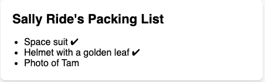
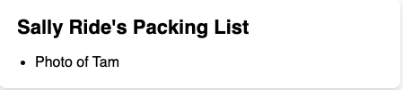
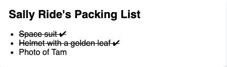
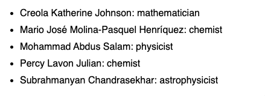
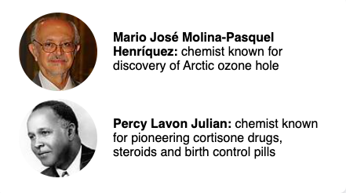
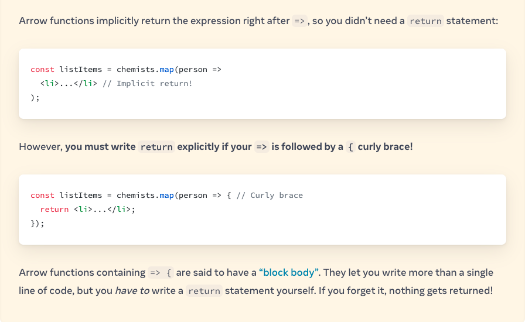
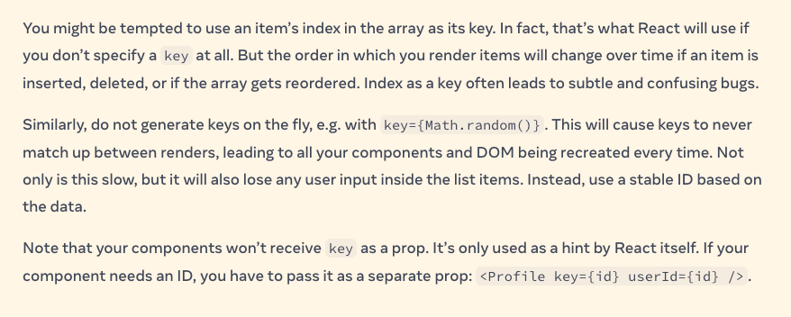
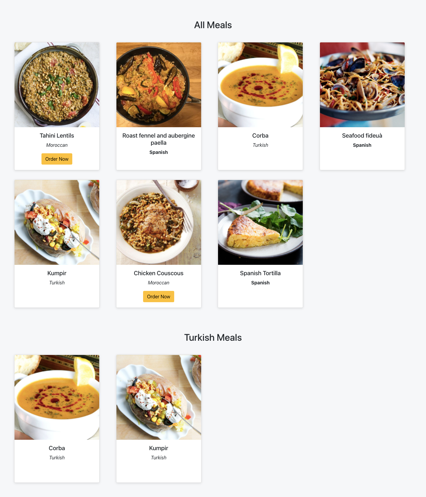
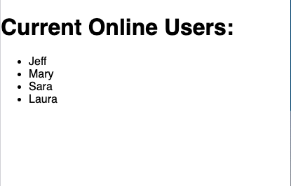

## Conditional Rendering
Your components will often need to display different things depending on different conditions. In React, you can conditionally render JSX using JavaScript syntax like `if` statements, `&&`, and `? :` operators.


### 1- Conditionally returning JSX:
Let’s say you have a PackingList component rendering several Items, which can be marked as packed or not:
- add a checkmark (✔) to packed items if isPacked={true}

```js
function Item({ name, isPacked }) {
  if (isPacked) {
    return <li className="item">{name} ✔</li>;
  }
  return <li className="item">{name}</li>;
}

export default function PackingList() {
  return (
    <section>
      <h1>Sally Ride's Packing List</h1>
      <ul>
        <Item 
          isPacked={true} 
          name="Space suit" 
        />
        <Item 
          isPacked={true} 
          name="Helmet with a golden leaf" 
        />
        <Item 
          isPacked={false} 
          name="Photo of Tam" 
        />
      </ul>
    </section>
  );
}
```



### 2- Conditionally returning nothing with null:

In some situations, you won’t want to render anything at all. For example, say you don’t want to show packed items at all. A component must return something. In this case, you can return null:

- If `isPacked` is `true`, the component will return `nothing`, null. Otherwise, it will return JSX to render.
-  returning null from a component `isn’t common` because it might surprise a developer trying to render it

```js
function Item({ name, isPacked }) {
  if (isPacked) {
    return null;
  }
  return <li className="item">{name}</li>;
}

export default function PackingList() {
  return (
    <section>
      <h1>Sally Ride's Packing List</h1>
      <ul>
        <Item 
          isPacked={true} 
          name="Space suit" 
        />
        <Item 
          isPacked={true} 
          name="Helmet with a golden leaf" 
        />
        <Item 
          isPacked={false} 
          name="Photo of Tam" 
        />
      </ul>
    </section>
  );
}
```



#### ** already have noticed some duplication in the render output, we should make our code more DRY ** 

### 3- Conditional (ternary) operator (? :)
JavaScript has a compact syntax for writing a conditional expression — the `conditional operator` or `“ternary operator.”`

- Instead of this: ( from point 1 )
```js
if (isPacked) {
  return <li className="item">{name} ✔</li>;
}
return <li className="item">{name}</li>;
```

- You can write this:
```js
return (
  <li className="item">
    {isPacked ? name + ' ✔' : name}
  </li>
);
```
- You can read it as “if isPacked is true, then (?) render name + ' ✔', otherwise (:) render name.”)


and the code will look like below:

```js
function Item({ name, isPacked }) {
  return (
    <li className="item">
      {isPacked ? (
        <del>
          {name + ' ✔'}
        </del>
      ) : (
        name
      )}
    </li>
  );
}

export default function PackingList() {
  return (
    <section>
      <h1>Sally Ride's Packing List</h1>
      <ul>
        <Item 
          isPacked={true} 
          name="Space suit" 
        />
        <Item 
          isPacked={true} 
          name="Helmet with a golden leaf" 
        />
        <Item 
          isPacked={false} 
          name="Photo of Tam" 
        />
      </ul>
    </section>
  );
}

```


### 4- Logical AND operator (&&)
Another common shortcut you’ll encounter is the `JavaScript logical AND (&&) operator`. Inside React components, it often comes up when you want to render some JSX when the condition is true, or render nothing otherwise. With &&, you could conditionally `render the checkmark only if isPacked is true`

```js
function Item({ name, isPacked }) {
  return (
    <li className="item">
      {name} {isPacked && '✔'}
    </li>
  );
}

export default function PackingList() {
  return (
    <section>
      <h1>Sally Ride's Packing List</h1>
      <ul>
        <Item 
          isPacked={true} 
          name="Space suit" 
        />
        <Item 
          isPacked={true} 
          name="Helmet with a golden leaf" 
        />
        <Item 
          isPacked={false} 
          name="Photo of Tam" 
        />
      </ul>
    </section>
  );
}

```

- You can read this as `if isPacked`, then (&&) render the checkmark, otherwise, render nothing.”

- A JavaScript `&& `expression returns the value of its right side (in our case, the checkmark) if the left side (our condition) is true. But if the condition is false, the whole expression becomes false. React considers false as a “hole” in the JSX tree, just like null or undefined, and doesn’t render anything in its place.


## Rendering Lists
You will often want to display multiple similar components from a collection of data. You can use the JavaScript array methods to manipulate an array of data. On this page, you’ll use `filter()` and `map()` with React to filter and transform your array of data into an array of components.
- to render components from an array using JavaScript’s `map()`
- to render only specific components using JavaScript’s `filter()`

### Rendering data from arrays:

```js
const people = [
  'Creola Katherine Johnson: mathematician',
  'Mario José Molina-Pasquel Henríquez: chemist',
  'Mohammad Abdus Salam: physicist',
  'Percy Lavon Julian: chemist',
  'Subrahmanyan Chandrasekhar: astrophysicist'
];

export default function List() {
  const listItems = people.map(person =>
    <li>{person}</li>
  );
  return <ul>{listItems}</ul>;
}
```



## Filtering arrays of items
Let’s say you want a way to only show people whose profession is 'chemist'. You can use JavaScript’s filter() method to return just those people. This method takes an array of items, passes them through a “test” (a function that returns true or false), and returns a new array of only those items that passed the test (returned true).
- `data.js`

```js
export const people = [{
  id: 0,
  name: 'Creola Katherine Johnson',
  profession: 'mathematician',
  accomplishment: 'spaceflight calculations',
  image: 'https://i.imgur.com/MK3eW3As.jpg'
}, {
  id: 1,
  name: 'Mario José Molina-Pasquel Henríquez',
  profession: 'chemist',
  accomplishment: 'discovery of Arctic ozone hole',
  image: 'https://i.imgur.com/mynHUSas.jpg'
}, {
  id: 2,
  name: 'Mohammad Abdus Salam',
  profession: 'physicist',
  accomplishment: 'electromagnetism theory',
  image: 'https://i.imgur.com/bE7W1jis.jpg'
}, {
  id: 3,
  name: 'Percy Lavon Julian',
  profession: 'chemist',
  accomplishment: 'pioneering cortisone drugs, steroids and birth control pills',
  image: 'https://i.imgur.com/IOjWm71s.jpg'
}, {
  id: 4,
  name: 'Subrahmanyan Chandrasekhar',
  profession: 'astrophysicist',
  accomplishment: 'white dwarf star mass calculations',
  image: 'https://i.imgur.com/lrWQx8ls.jpg'
}];
```

- `App.js`

```js
import { people } from './data.js';
export default function List() {
  const chemists = people.filter(person =>
    person.profession === 'chemist'
  );
  const listItems = chemists.map(person =>
    <li key={person.id}>
      
      <p>
        <b>{person.name}:</b>
        {' ' + person.profession + ' '}
        known for {person.accomplishment}
      </p>
    </li>
  );
  return <ul>{listItems}</ul>;
}
```




### ** Important note about arrow function **



## Keeping list items in order with key:
Keys tell React which array item each component corresponds to, so that it can match them up later. This becomes important if your array items can move (e.g. due to sorting), `get inserted`, or `get deleted`. A well-chosen `key` helps React infer what exactly has happened, and make the correct updates to the DOM tree.

### Where to get your key?
Different sources of data provide different sources of keys:

 - `Data from a database`: If your data is coming from a database, you can use the database keys/IDs, which are unique by nature.
- `Locally generated data`: If your data is generated and persisted locally (e.g. notes in a note-taking app), use an incrementing counter or a package like `uuid` when creating items.


### Rules of keys:
 - Keys must be unique among siblings. However, it’s okay to use the same keys for JSX nodes in different arrays.
 - Keys must not change or that defeats their purpose! Don’t generate them while rendering.

 ### Why does React need keys?
 Imagine that files on your desktop didn’t have names. Instead, you’d refer to them by their order — the first file, the second file, and so on. You could get used to it, but once you delete a file, it would get confusing. The second file would become the first file, the third file would be the second file, and so on.

 

## Practice Time (Simple Meals App)

- Create react app that renders list of meals using `map()` and render the turkish meals using `filter()`
- Render `<button>Order Now<</button>` if the meal is `Moroccan` using the `Conditional Rendering` concept. 
-  If the meals is `Spanish` render the area in `<strong></strong>` tag, otherwise in `<em></em>` tag




- Your app sturcture should look like this:

```
/meals-app
   /src
    /App.js
    /index.js
    /mealsData.js
    /components
      /Meals.js
      /Meal.js  
```
- use this meals list below in your app
- `mealsData.js`

```js
export const meals = [
  {
    strMeal: "Tahini Lentils",
    strMealThumb:
      "https://www.themealdb.com/images/media/meals/vpxyqt1511464175.jpg",
    idMeal: "52869",
    area: "Moroccan",
  },
  {
    strMeal: "Roast fennel and aubergine paella",
    strMealThumb: "https://www.themealdb.com/images/media/meals/1520081754.jpg",
    idMeal: "52942",
    area: "Spanish",
  },
  {
    strMeal: "Corba",
    strMealThumb:
      "https://www.themealdb.com/images/media/meals/58oia61564916529.jpg",
    idMeal: "52977",
    area: "Turkish",
  },
  {
    strMeal: "Seafood fideuà",
    strMealThumb:
      "https://www.themealdb.com/images/media/meals/wqqvyq1511179730.jpg",
    idMeal: "52836",
    area: "Spanish",
  },

  {
    strMeal: "Kumpir",
    strMealThumb:
      "https://www.themealdb.com/images/media/meals/mlchx21564916997.jpg",
    idMeal: "52978",
    area: "Turkish",
  },
  {
    strMeal: "Chicken Couscous",
    strMealThumb:
      "https://www.themealdb.com/images/media/meals/qxytrx1511304021.jpg",
    idMeal: "52850",
    area: "Moroccan",
  },
  {
    strMeal: "Spanish Tortilla",
    strMealThumb:
      "https://www.themealdb.com/images/media/meals/quuxsx1511476154.jpg",
    idMeal: "52872",
    area: "Spanish",
  },
];

```

- Use react bootstrap for rapid design
  - instaltion steps:
    ```
     npm install react-bootstrap bootstrap
    ```
  - In the index.js (the root component) add the import below:
    ```
     import 'bootstrap/dist/css/bootstrap.min.css';
     ```
- you can use `Inline Styling` using js objects either:
    ```js
    <div style={{width: '10rem', padding:"2rem"}}>
        .....
    </div>
    ```
  or 
    ```js
    const myStyles= {
    width: '10rem',
    padding: "2rem",
    }

    <div style={myStyles}>
        .....
    </div>
    ```

- `App.js`

```js
import Meals from './components/Meals';

function App() {
  return (
    <div style={{ backgroundColor: '#f6f7f9', padding: '1rem'}}>
      <Meals/>
    </div>
  );
}

export default App;
```

- `Meals.js`
```js
import React from "react";
import { meals } from "../mealsData";
import Meal from "./Meal";

function Meals() {
  const turkishMeals = meals.filter((meal) => meal.area === "Turkish");

  const turkishItems = turkishMeals.map((meal) => (
    <Meal key={meal.idMeal} {...meal} />
  ));

  const allMeals = meals.map((meal) => <Meal key={meal.idMeal} {...meal} />);
  const mystyle = {
    display: "grid",
    padding: "2rem",
    gridTemplateColumns: "1fr 1fr 1fr 1fr",
    gridGap: "2rem",
    alignItems: "center",
  };

  return (
    <>
      <h2 className="text-center mt-5">All Meals</h2>
      <div style={mystyle}>{allMeals}</div>
      <h2 className="text-center mt-5">Turkish Meals</h2>
      <div style={mystyle}>{turkishItems}</div>
    </>
  );
}

export default Meals;

```

- `Meal.js`
```js
import React from "react";
import Card from "react-bootstrap/Card";
import Button from "react-bootstrap/Button";

function Meal({ strMeal, strMealThumb, area }) {
  return (
    <Card
      style={{
        width: "18rem",
        height: "27rem",
        boxShadow: "rgba(99, 99, 99, 0.2) 0px 2px 8px 0px",
        textAlign: "center",
      }}
    >
      <Card.Img variant="top" src={strMealThumb} />
      <Card.Body>
        <Card.Title>{strMeal}</Card.Title>
        <Card.Text>
          {area === "Spanish" ? <strong>{area}</strong> : <em>{area}</em>}
        </Card.Text>
        {area === "Moroccan" && <Button variant="warning">Order Now</Button>}
      </Card.Body>
    </Card>
  );
}

export default Meal;
```

- `App.css`
```css
.meals-container{
  padding: 2rem;
  display: grid;
  grid-template-columns: 1fr 1fr 1fr 1fr;
  grid-gap: 2em;
  align-items: center;
}
```

## Your Turn Now :)

<hr>

- modifiy the code below to Filter the array so you see only the users who are online.

```js
class MyComponent extends React.Component {
  constructor(props) {
    super(props);
    this.state = {
      users: [
        {
          username: 'Jeff',
          online: true
        },
        {
          username: 'Alan',
          online: false
        },
        {
          username: 'Mary',
          online: true
        },
        {
          username: 'Jim',
          online: false
        },
        {
          username: 'Sara',
          online: true
        },
        {
          username: 'Laura',
          online: true
        }
      ]
    };
  }
  render() {
    const usersOnline = null; // Change this line
    const renderOnline = null; // Change this line
    return (
      <div>
        <h1>Current Online Users:</h1>
        <ul>{renderOnline}</ul>
      </div>
    );
  }
}
```

- the solution should look like this:



<details>
  <summary>Hint</summary>
  
 - To do this, first use `filter()` to return a new array containing only the users whose online property is true. Then, in the `renderOnline` variable, map over the filtered array, and return a `li` element for each user that contains the text of their `username`. Be sure to include a unique `key` as well.
</details>

<details>
  <summary>Solution</summary>
  
 ```js
 class MyComponent extends React.Component {
  constructor(props) {
    super(props);
    this.state = {
      users: [
        {
          username: 'Jeff',
          online: true
        },
        {
          username: 'Alan',
          online: false
        },
        {
          username: 'Mary',
          online: true
        },
        {
          username: 'Jim',
          online: false
        },
        {
          username: 'Sara',
          online: true
        },
        {
          username: 'Laura',
          online: true
        }
      ]
    };
  }
  render() {
    const usersOnline = this.state.users.filter(user => user.online === true)
    const renderOnline = usersOnline.map((user, i) => (
      <li key={i}>
        {user.username}
      </li>
    ))
    return (
      <div>
        <h1>Current Online Users:</h1>
        <ul>{renderOnline}</ul>
      </div>
    );
  }
}
 ```
</details>


<hr>

Additional Resources:
- [uuid](https://www.npmjs.com/package/uuid)
- [react bootstrap](https://react-bootstrap.netlify.app/)