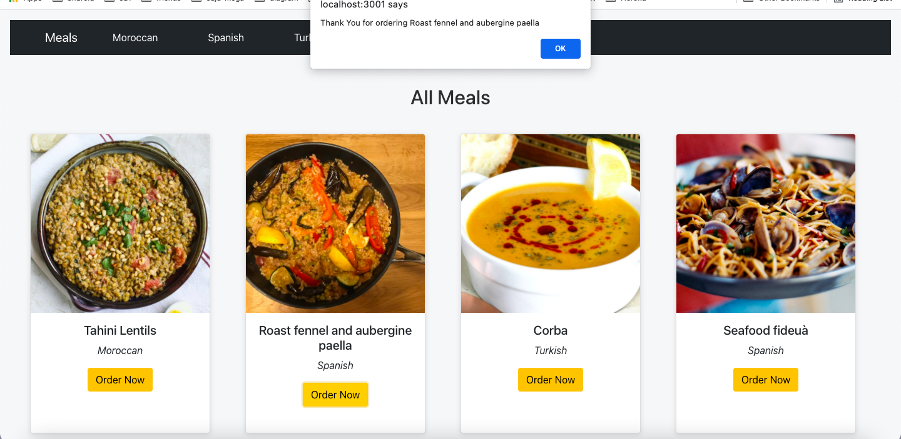

## Event Handling

###  Events in React:
 An event gets triggered when a user performs some action causing the change of state. Handling events in React is similar to handling HTML DOM element events.
 - React events use `camelCase` syntax for naming. Ex: `onClick()`
 - Event handlers are written inside curly braces. Ex: `onClick={print}`
- With JSX you pass a function as the event handler.
 - To prevent the default behavior, explicitly call the `preventDefault()` method.
   ```js
    function handleClick(e) {
        e.preventDefault();
    }
    ```


### Bind `this`:
- In JavaScript, class methods are not bound by default.
 - Needed only in case of `Class components`.
 - `this` represents the component that owns the method.
 -  Use `arrow functions () => {}` to avoid confusion about `this`.


### Notes:


- [Event Handlers example in codesandbox](https://codesandbox.io/s/sandpack-project-forked-muos6)

### Event propagation:
Event handlers will also catch events from any children your component might have. We say that an event “bubbles” or “propagates” up the tree: it starts with where the event happened, and then goes up the tree.


### Stopping propagation:

Event handlers receive an event object as their only argument. By convention, it’s usually called e, which stands for “event.” You can use this object to read information about the event.

That event object also lets you stop the propagation. If you want to prevent an event from reaching parent components, you need to call `e.stopPropagation()`

- [Event Propagation example in codesandbox](https://codesandbox.io/s/sandpack-project-forked-t7zmy)


## Practice Time (Simple Gallery App)


- Your app sturcture should look like this:

```
/gallery-app
   /src
    /App.js
    /index.js
    /data.js
    /components
      /Gallery.js 
```
- use this Sculpture list below in your app
- `data.js`

```js
export const sculptureList = [{
    name: 'Homenaje a la Neurocirugía',
    artist: 'Marta Colvin Andrade',
    description: 'Although Colvin is predominantly known for abstract themes that allude to pre-Hispanic symbols, this gigantic sculpture, an homage to neurosurgery, is one of her most recognizable public art pieces.',
    url: 'https://i.imgur.com/Mx7dA2Y.jpg',
    alt: 'A bronze statue of two crossed hands delicately holding a human brain in their fingertips.'
  }, {
    name: 'Floralis Genérica',
    artist: 'Eduardo Catalano',
    description: 'This enormous (75 ft. or 23m) silver flower is located in Buenos Aires. It is designed to move, closing its petals in the evening or when strong winds blow and opening them in the morning.',
    url: 'https://i.imgur.com/ZF6s192m.jpg',
    alt: 'A gigantic metallic flower sculpture with reflective mirror-like petals and strong stamens.'
  }, {
    name: 'Eternal Presence',
    artist: 'John Woodrow Wilson',
    description: 'Wilson was known for his preoccupation with equality, social justice, as well as the essential and spiritual qualities of humankind. This massive (7ft. or 2,13m) bronze represents what he described as "a symbolic Black presence infused with a sense of universal humanity."',
    url: 'https://i.imgur.com/aTtVpES.jpg',
    alt: 'The sculpture depicting a human head seems ever-present and solemn. It radiates calm and serenity.'
  }, {
    name: 'Moai',
    artist: 'Unknown Artist',
    description: 'Located on the Easter Island, there are 1,000 moai, or extant monumental statues, created by the early Rapa Nui people, which some believe represented deified ancestors.',
    url: 'https://i.imgur.com/RCwLEoQm.jpg',
    alt: 'Three monumental stone busts with the heads that are disproportionately large with somber faces.'
  }, {
    name: 'Blue Nana',
    artist: 'Niki de Saint Phalle',
    description: 'The Nanas are triumphant creatures, symbols of femininity and maternity. Initially, Saint Phalle used fabric and found objects for the Nanas, and later on introduced polyester to achieve a more vibrant effect.',
    url: 'https://i.imgur.com/Sd1AgUOm.jpg',
    alt: 'A large mosaic sculpture of a whimsical dancing female figure in a colorful costume emanating joy.'
  }, {
    name: 'Ultimate Form',
    artist: 'Barbara Hepworth',
    description: 'This abstract bronze sculpture is a part of The Family of Man series located at Yorkshire Sculpture Park. Hepworth chose not to create literal representations of the world but developed abstract forms inspired by people and landscapes.',
    url: 'https://i.imgur.com/2heNQDcm.jpg',
    alt: 'A tall sculpture made of three elements stacked on each other reminding of a human figure.'
  }, {
    name: 'Cavaliere',
    artist: 'Lamidi Olonade Fakeye',
    description: "Descended from four generations of woodcarvers, Fakeye's work blended traditional and contemporary Yoruba themes.",
    url: 'https://i.imgur.com/wIdGuZwm.png',
    alt: 'An intricate wood sculpture of a warrior with a focused face on a horse adorned with patterns.'
  }, {
    name: 'Big Bellies',
    artist: 'Alina Szapocznikow',
    description: "Szapocznikow is known for her sculptures of the fragmented body as a metaphor for the fragility and impermanence of youth and beauty. This sculpture depicts two very realistic large bellies stacked on top of each other, each around five feet (1,5m) tall.",
    url: 'https://i.imgur.com/AlHTAdDm.jpg',
    alt: 'The sculpture reminds a cascade of folds, quite different from bellies in classical sculptures.'
  }, {
    name: 'Terracotta Army',
    artist: 'Unknown Artist',
    description: 'The Terracotta Army is a collection of terracotta sculptures depicting the armies of Qin Shi Huang, the first Emperor of China. The army consited of more than 8,000 soldiers, 130 chariots with 520 horses, and 150 cavalry horses.',
    url: 'https://i.imgur.com/HMFmH6m.jpg',
    alt: '12 terracotta sculptures of solemn warriors, each with a unique facial expression and armor.'
  }, {
    name: 'Lunar Landscape',
    artist: 'Louise Nevelson',
    description: 'Nevelson was known for scavenging objects from New York City debris, which she would later assemble into monumental constructions. In this one, she used disparate parts like a bedpost, juggling pin, and seat fragment, nailing and gluing them into boxes that reflect the influence of Cubism’s geometric abstraction of space and form.',
    url: 'https://i.imgur.com/rN7hY6om.jpg',
    alt: 'A black matte sculpture where the individual elements are initially indistinguishable.'
  }, {
    name: 'Aureole',
    artist: 'Ranjani Shettar',
    description: 'Shettar merges the traditional and the modern, the natural and the industrial. Her art focuses on the relationship between man and nature. Her work was described as compelling both abstractly and figuratively, gravity defying, and a "fine synthesis of unlikely materials."',
    url: 'https://i.imgur.com/okTpbHhm.jpg',
    alt: 'A pale wire-like sculpture mounted on concrete wall and descending on the floor. It appears light.'
  }, {
    name: 'Hippos',
    artist: 'Taipei Zoo',
    description: 'The Taipei Zoo commissioned a Hippo Square featuring submerged hippos at play.',
    url: 'https://i.imgur.com/6o5Vuyu.jpg',
    alt: 'A group of bronze hippo sculptures emerging from the sett sidewalk as if they were swimming.'
  }];
  
```

- `App.js`

```js
import Gallery from './components/Gallery';
import './App.css';
function App() {
  return (
    <div className="app-container">
      <h2>Sculpture List</h2>
      <Gallery/>
    </div>
  );
}

export default App;
```

- `Gallery.js`
```js
import React, { Component } from "react";
import { sculptureList } from "../data";

export default class Gallery extends Component {
  constructor() {
    super();
    this.state = {
      index: 0,
      showMore: false,
    };
  }

  handleNextClick = () => {
    if (this.state.index + 1 < sculptureList.length) {
      this.setState({
        index: this.state.index + 1,
      });
    } else {
      this.setState({
        index: 0,
      });
    }
  };

  handleMoreClick = () => {
    this.setState({
      showMore: !this.state.showMore,
    });
  };

  render() {
    const { index, showMore } = this.state;
    let sculpture = sculptureList[index];

    return (
      <div className="container">
        <section>
          <div className="top-container">
            <button onClick={this.handleNextClick}>Next &gt;&gt; </button>

            <h4>
              <i>{sculpture.name} </i>
              by {sculpture.artist}
            </h4>
            <h5>
              ({index + 1} of {sculptureList.length})
            </h5>
          </div>
          <button onClick={this.handleMoreClick}>
            {showMore ? "Hide" : "Show"} details
          </button>
          {showMore && <p>{sculpture.description}</p>}
        </section>

        
      </div>
    );
  }
}

```

- `App.css`
```css
* {
  box-sizing: border-box;
}

body {
  font-family: sans-serif;
  padding: 0;
  margin: 0;
}

.app-container {
  display: flex;
  flex-direction: column;
  justify-content: center;
  align-items: center;
  background-color: rgb(33, 16, 94);
  height: 100vh;
}
h2 {
  color: whitesmoke;
}

h4,
h5 {
  text-align: center;
}

h5 {
  color: rgb(247, 163, 9);
}

.container {
  background-color: whitesmoke;
  padding: 1rem;
  display: flex;
  flex-direction: row-reverse;
  justify-content: space-between;
  align-items: center;
  color: #343434;
  border-radius: 0.5rem;
}

section {
  padding: 0 1rem;
  width: 60rem;
  height: 20rem;
  text-align: center;
}

.top-container {
  display: flex;
  flex-direction: row;
  justify-content: space-between;
  align-items: center;
}

button {
  margin: 1rem !important;
  padding: 0.5rem 1.5rem;
  border: none;
  background-color: rgb(247, 163, 9);

  border-radius: 2rem !important;
  color: aliceblue;
  font-size: medium;
}

button:hover {
  background-color: rgb(67, 43, 152);
}

img {
  width: 20rem;
  box-shadow: rgba(100, 100, 111, 0.2) 0px 7px 29px 0px;
}

p {
  padding: 0 12rem;
  text-align: center;
  margin-top: 2rem;
  color: rgb(47, 41, 69);
}
```

## React Router:
React Router is a third party library that makes it easy for us to route URLs - not to different pages, but by dynamically loading different components on the same page as the user navigates to different URLs. Once we define how the URLs are routed to the components, React Router will manage our Single Page App's browser history automatically.

### Installing React Router:
```js
npm i react-router-dom@5.3.0
```

React Router uses some of its own components to define how URLs are routed to your components and to create links to those routes. 
- You must have one `<Router>` component that wraps itself around multiple `<Route>` components. Each `<Route>` component has two pieces:

- `path` - defining the URL path that leads to the component.
- `component` - defining what component users will see when they navigate to the path.

```js

import {
  BrowserRouter as Router,
  Switch,
  Route,
  Link
} from 'react-router-dom';

import Home from './Home'
import Menu from './Menu';
import AboutUs from './AboutUs';

export default function App() {
  return (
    <Router>
     <nav>
        <Link to="/">Home</Link>
        <Link to="/menu">Menu</Link>
        <Link to="/aboutUs">About Us</Link>
      </nav>

      <Switch>
        <Route exact path="/" component={Home} />
        <Route path="/menu" component={Menu} />
        <Route path="/aboutUs" component={AboutUs} />
      </Switch>
    </Router>
  );
}
```

### important things to note here:

- This goes in place of your existing component calls of `<Home />` or `<Home></Home>` (depending on which syntax you went for).

- The first route for the homepage at the root URL path `/ ` uses a special extra `exact` attribute before defining the path. The `exact` attribute means the component associated with the route will only be shown if users are at exactly that URL path. If you forget to include the exact keyword, when someone navigates to `/aboutUs` they will actually see two components, because `/` is a partial match for /aboutUs.

- Notice that all of the `<Route>` components are wrapped inside one `<div>`. Like render, the `<Router>` element can only have one direct child element. If you don't wrap the routes with a `<div>`, the page will appear blank.

- The Router component is actually called `BrowserRouter` inside the library package, but we'll use the `as` keyword to rename it to `Router` so it's easier to remember.

- You can wrap the `App` component inside ` <Router>` element in `index.js` to make the access available to all the child components.

    ```js
    import {BrowserRouter as Router} from 'react-router-dom'
    ReactDOM.render(
        <Router>
            <App />
        </Router>,
    document.getElementById('root')
    );
    ```

### Navigate to the Routes:

we can wrap `<Link>` tags around whatever text that we want to display to the user to click on. The pieces of this are:

`<Link>` : creates `<a>` tags and automatically integrates modern HTML5 browser history mechanics for the Single Page Application. It has one attribute:
- `to`: what path to navigate to when the user clicks the link.

We can include those links in a `<nav>` element at the top of our page. It will stay on the page permanently, and the different components will be swapped between each other below it.

### Pass props through React Router:

```js
const menuArray = [
  'chicken',
  'Tea',
  'Cola',
  'Soup'
]
```

There is many ways to do this like:

- ```js
    <Route path="/menu" component={() => <Menu menuArray={menuArray}/>} />
    ```

- ```js
    <Route path="/menu" >
        <Menu menuArray={menuArray}>
    </Route>
    ```
### Switch:
Renders the first child `<Route>` that matches the location.
- `<Switch>` is unique in that it renders a route exclusively. In contrast, every <Route> that matches the location renders inclusively.

## Your Turn Now :)


- Update your perivous meals-app using `react router`. Use `<NavBar>` using react bootstrap to Navigate to the Routes.

- From the `master` branch make a new branch called `meals-router`

```js
git branch meals-router
```

- switch to the branch
```js
git checkout meals-router
```


- Your app sturcture should look like this:

```
/meals-app
   /src
    /App.js
    /App.css
    /index.js
    /mealsData.js
    /components
      /Meals.js
      /NavBar.js
      /AllMeals.js
      /MoroccanMeals.js
      /SpanishMeals.js
      /TurkishMeals.js
      /Meal.js  
```

- The`NavBar` contains `Meals`, `Moroccan`, `Spanish`, `Turkish` nav links.

  - `Meals`: to show all meals. make `AllMeals.js` component.

  - `Moroccan`: to show moroccan meals. make `MoroccanMeals.js` component.

  - `Spanish`: to show spanish meals. make `SpanishMeals.js` component.

  - `Turkish`: to show turkish meals. make `TurkishMeals.js` component.

- Make an Event handler for the `Order Now` button, when clicked show this message `Thank You for ordering <strMeal>` on alert box.




<details>
  <summary>Solution</summary>
  
- `index.js`
 ```js
import React from 'react';
import ReactDOM from 'react-dom';
import './index.css';
import App from './App';
import reportWebVitals from './reportWebVitals';
import 'bootstrap/dist/css/bootstrap.min.css';
import { BrowserRouter as Router } from 'react-router-dom'


ReactDOM.render(
  <Router>
    <App />
  </Router>,
  document.getElementById('root')
);

// If you want to start measuring performance in your app, pass a function
// to log results (for example: reportWebVitals(console.log))
// or send to an analytics endpoint. Learn more: https://bit.ly/CRA-vitals
reportWebVitals();

 ```
- `App.js`
```js
import Meals from './components/Meals';
import './App.css';


function App() {
  return (
    <div style={{ backgroundColor: '#f6f7f9', padding: '1rem'}}>
      <Meals/>
    </div>
  );
}

export default App;

```
- `Meals.js`
```js
import React from "react";
import Navbar from "./Navbar";
import { meals } from "../mealsData";
import { Route, Switch } from "react-router-dom";
import MoroccanMeals from "./MoroccanMeals";
import AllMeals from "./AllMeals";
import TurkishMeals from "./TurkishMeals";
import SpanishMeals from "./SpanishMeals";

function Meals() {
  return (
    <>
      <Navbar />

      <Switch>
        <Route exact path="/">
          <AllMeals meals={meals} />
        </Route>
        <Route path="/moroccan">
          <MoroccanMeals meals={meals} />
        </Route>
        <Route path="/turkish">
          <TurkishMeals meals={meals} />
        </Route>
        <Route path="/spanish">
          <SpanishMeals meals={meals} />
        </Route>
      </Switch>
    </>
  );
}

export default Meals;

```

- `Navbar.js`

```js
import React from "react";
import { Link } from "react-router-dom";
import Navbar from "react-bootstrap/Navbar";
import Nav from "react-bootstrap/Nav";
import Container from "react-bootstrap/Container";

function NavBar() {
  return (
    <Navbar bg="dark" expand="lg">
      <Container>
        <Navbar.Brand>
          <Link to="/"> Meals</Link>
        </Navbar.Brand>
        <Navbar.Toggle aria-controls="basic-navbar-nav" />
        <Navbar.Collapse id="basic-navbar-nav">
          <Nav className="me-auto">
            <Nav.Link>
              {" "}
              <Link to="/moroccan"> Moroccan</Link>
            </Nav.Link>
            <Nav.Link>
              <Link to="/spanish"> Spanish</Link>
            </Nav.Link>
            <Nav.Link>
              {" "}
              <Link to="/turkish"> Turkish</Link>
            </Nav.Link>
          </Nav>
        </Navbar.Collapse>
      </Container>
    </Navbar>
  );
}

export default NavBar;
```

- `AllMeals.js`
```js
import React from "react";
import Meal from "./Meal";

function AllMeals({ meals }) {
  const allMeals = meals.map((meal) => <Meal key={meal.idMeal} {...meal} />);
  return (
    <div>
      <h2>All Meals</h2>
      <div className="cards-container">{allMeals}</div>
    </div>
  );
}

export default AllMeals;

```

- `MoroccanMeals.js`
```js
import React from "react";
import Meal from "./Meal";

function MoroccanMeals({ meals }) {
  const moroccanMeals = meals.filter((meal) => meal.area === "Moroccan");

  const moroccanItems = moroccanMeals.map((meal) => (
    <Meal key={meal.idMeal} {...meal} />
  ));
  return (
    <div>
      <h2>Moroccan Meals</h2>
      <div className="cards-container">{moroccanItems}</div>
    </div>
  );
}

export default MoroccanMeals;

```

- `TurkishMeals.js`
```js
import React from "react";
import Meal from "./Meal";

function TurkishMeals({ meals }) {
  const turkishMeals = meals.filter((meal) => meal.area === "Turkish");

  const turkishItems = turkishMeals.map((meal) => (
    <Meal key={meal.idMeal} {...meal} />
  ));

  return (
    <div>
      <h2>Turkish Meals</h2>
      <div className="cards-container">{turkishItems}</div>
    </div>
  );
}

export default TurkishMeals;

```

- `SpanishMeals.js`
```js
import React from "react";
import Meal from "./Meal";

function SpanishMeals({ meals }) {
  const spanishMeals = meals.filter((meal) => meal.area === "Spanish");

  const spanishItems = spanishMeals.map((meal) => (
    <Meal key={meal.idMeal} {...meal} />
  ));

  return (
    <div>
      <h2>Spanish Meals </h2>
      <div className="cards-container">{spanishItems}</div>
    </div>
  );
}

export default SpanishMeals;

```

- `Meal.js`
```js
import React from "react";
import Card from "react-bootstrap/Card";
import Button from "react-bootstrap/Button";

function Meal({ strMeal, strMealThumb, area }) {

  function clickHandler (){
    alert(`Thank You for ordering ${strMeal}`)
  }

  return (
    <Card
      style={{
        width: "18rem",
        height: "30rem",
        boxShadow: "rgba(99, 99, 99, 0.2) 0px 2px 8px 0px",
        textAlign: "center",
      }}
    >
      <Card.Img variant="top" src={strMealThumb} />
      <Card.Body>
        <Card.Title>{strMeal}</Card.Title>
        <Card.Text>
          <em>{area}</em>
        </Card.Text>
        <Button variant="warning" onClick={clickHandler}>Order Now</Button>
      </Card.Body>
    </Card>
  );
}

export default Meal;


```


- `App.css`
```css
.meals-container {
  padding: 2rem;
  display: grid;
  grid-template-columns: 1fr 1fr 1fr 1fr;
  grid-gap: 2em;
  align-items: center;
}

.cards-container {
  display: grid;
  padding: 2rem;
  grid-template-columns: 1fr 1fr 1fr 1fr;
  grid-gap: 2rem;
  align-items: center;
}

h2 {
  text-align: center;
  padding-top: 3rem;
  color: rgb(44, 46, 46);
}

a {
  text-decoration: none !important;
  color: rgb(154, 37, 24) !important;
  margin-right: 2rem;
}

a:hover {
  color: rgb(226, 61, 43) !important;
}
```
</details>


<hr>

Additional Resources:
- [react-router-dom](https://www.npmjs.com/package/react-router-dom/v/5.3.0)
- [react bootstrap](https://react-bootstrap.netlify.app/)
- [reactrouter - quick start](https://reactrouter.com/web/guides/quick-start)

