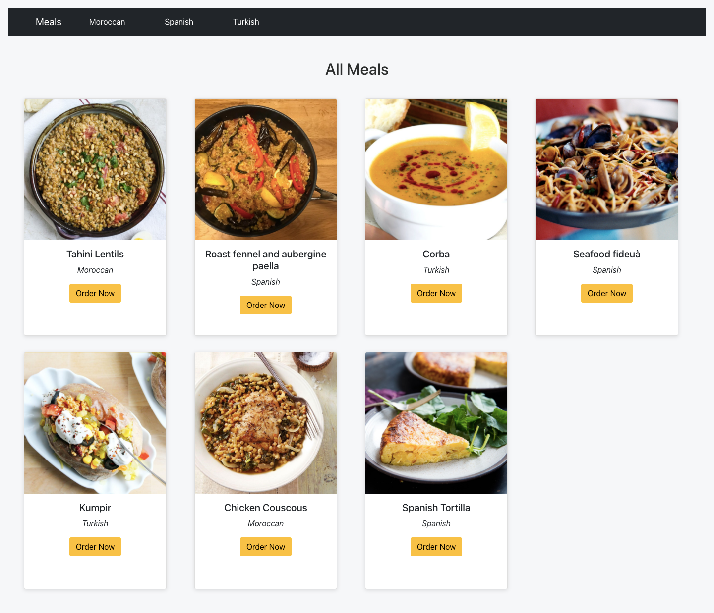
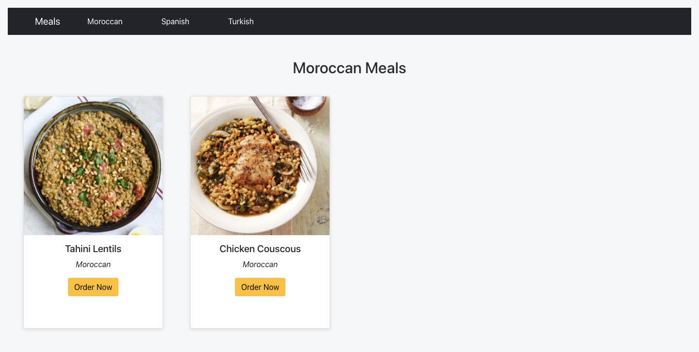
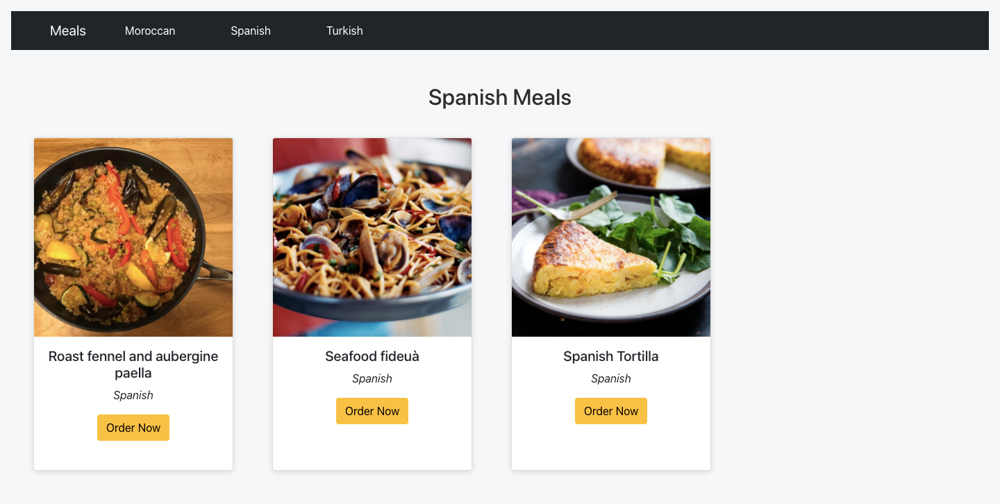
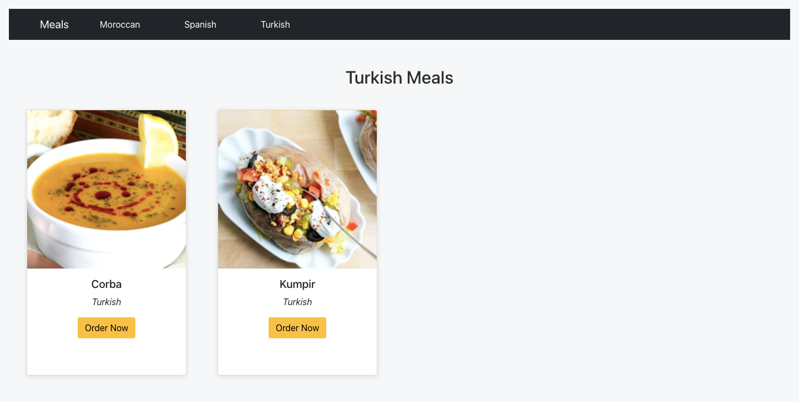
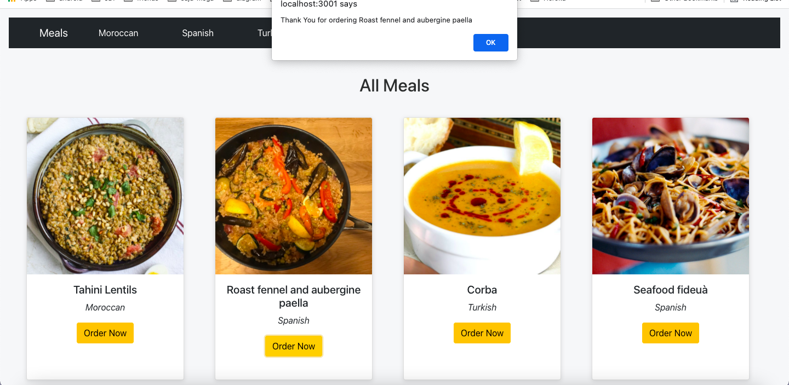

## React Router:
React Router is a third party library that makes it easy for us to route URLs - not to different pages, but by dynamically loading different components on the same page as the user navigates to different URLs. Once we define how the URLs are routed to the components, React Router will manage our Single Page App's browser history automatically.

### Installing React Router:
```js
npm i react-router-dom@5.3.0
```

React Router uses some of its own components to define how URLs are routed to your components and to create links to those routes. 
- You must have one `<Router>` component that wraps itself around multiple `<Route>` components. Each `<Route>` component has two pieces:

- `path` - defining the URL path that leads to the component.
- `component` - defining what component users will see when they navigate to the path.

```js

import {
  BrowserRouter as Router,
  Switch,
  Route,
  Link
} from 'react-router-dom';

import Home from './Home'
import Menu from './Menu';
import AboutUs from './AboutUs';

export default function App() {
  return (
    <Router>
     <nav>
        <Link to="/">Home</Link>
        <Link to="/menu">Menu</Link>
        <Link to="/aboutUs">About Us</Link>
      </nav>

      <Switch>
        <Route exact path="/" component={Home} />
        <Route path="/menu" component={Menu} />
        <Route path="/aboutUs" component={AboutUs} />
      </Switch>
    </Router>
  );
}
```

### important things to note here:

- This goes in place of your existing component calls of `<Home />` or `<Home></Home>` (depending on which syntax you went for).

- The first route for the homepage at the root URL path `/ ` uses a special extra `exact` attribute before defining the path. The `exact` attribute means the component associated with the route will only be shown if users are at exactly that URL path. If you forget to include the exact keyword, when someone navigates to `/aboutUs` they will actually see two components, because `/` is a partial match for /aboutUs.

- Notice that all of the `<Route>` components are wrapped inside one `<div>`. Like render, the `<Router>` element can only have one direct child element. If you don't wrap the routes with a `<div>`, the page will appear blank.

- The Router component is actually called `BrowserRouter` inside the library package, but we'll use the `as` keyword to rename it to `Router` so it's easier to remember.

- You can wrap the `App` component inside ` <Router>` element in `index.js` to make the access available to all the child components.

    ```js
    import {BrowserRouter as Router} from 'react-router-dom'
    ReactDOM.render(
        <Router>
            <App />
        </Router>,
    document.getElementById('root')
    );
    ```

### Navigate to the Routes:

we can wrap `<Link>` tags around whatever text that we want to display to the user to click on. The pieces of this are:

`<Link>` : creates `<a>` tags and automatically integrates modern HTML5 browser history mechanics for the Single Page Application. It has one attribute:
- `to`: what path to navigate to when the user clicks the link.

We can include those links in a `<nav>` element at the top of our page. It will stay on the page permanently, and the different components will be swapped between each other below it.

### Pass props through React Router:

```js
const menuArray = [
  'chicken',
  'Tea',
  'Cola',
  'Soup'
]
```

There is many ways to do this like:

- ```js
    <Route path="/menu" component={() => <Menu menuArray={menuArray}/>} />
    ```

- ```js
    <Route path="/menu" >
        <Menu menuArray={menuArray}>
    </Route>
    ```
### Switch:
Renders the first child `<Route>` that matches the location.
- `<Switch>` is unique in that it renders a route exclusively. In contrast, every <Route> that matches the location renders inclusively.

## Your Turn Now :)


- Update your perivous meals-app using `react router`. Use `<NavBar>` using react bootstrap to Navigate to the Routes.

- From the `master` branch make a new branch called `meals-router`

```js
git branch meals-router
```

- switch to the branch
```js
git checkout meals-router
```






- Your app sturcture should look like this:

```
/meals-app
   /src
    /App.js
    /App.css
    /index.js
    /mealsData.js
    /components
      /Meals.js
      /NavBar.js
      /AllMeals.js
      /MoroccanMeals.js
      /SpanishMeals.js
      /TurkishMeals.js
      /Meal.js  
```

- The`NavBar` contains `Meals`, `Moroccan`, `Spanish`, `Turkish` nav links.

  - `Meals`: to show all meals. make `AllMeals.js` component.

  - `Moroccan`: to show moroccan meals. make `MoroccanMeals.js` component.

  - `Spanish`: to show spanish meals. make `SpanishMeals.js` component.

  - `Turkish`: to show turkish meals. make `TurkishMeals.js` component.

- Make an Event handler for the `Order Now` button, when clicked show this message `Thank You for ordering <strMeal>` on alert box.




<details>
  <summary>Solution</summary>
  
- `index.js`
 ```js
import React from 'react';
import ReactDOM from 'react-dom';
import './index.css';
import App from './App';
import reportWebVitals from './reportWebVitals';
import 'bootstrap/dist/css/bootstrap.min.css';
import { BrowserRouter as Router } from 'react-router-dom'


ReactDOM.render(
  <Router>
    <App />
  </Router>,
  document.getElementById('root')
);

// If you want to start measuring performance in your app, pass a function
// to log results (for example: reportWebVitals(console.log))
// or send to an analytics endpoint. Learn more: https://bit.ly/CRA-vitals
reportWebVitals();

 ```
- `App.js`
```js
import Meals from './components/Meals';
import './App.css';


function App() {
  return (
    <div style={{ backgroundColor: '#f6f7f9', padding: '1rem'}}>
      <Meals/>
    </div>
  );
}

export default App;

```
- `Meals.js`
```js
import React from "react";
import Navbar from "./Navbar";
import { meals } from "../mealsData";
import { Route, Switch } from "react-router-dom";
import MoroccanMeals from "./MoroccanMeals";
import AllMeals from "./AllMeals";
import TurkishMeals from "./TurkishMeals";
import SpanishMeals from "./SpanishMeals";

function Meals() {
  return (
    <>
      <Navbar />

      <Switch>
        <Route exact path="/">
          <AllMeals meals={meals} />
        </Route>
        <Route path="/moroccan">
          <MoroccanMeals meals={meals} />
        </Route>
        <Route path="/turkish">
          <TurkishMeals meals={meals} />
        </Route>
        <Route path="/spanish">
          <SpanishMeals meals={meals} />
        </Route>
      </Switch>
    </>
  );
}

export default Meals;

```

- `Navbar.js`

```js
import React from "react";
import { Link } from "react-router-dom";
import Navbar from "react-bootstrap/Navbar";
import Nav from "react-bootstrap/Nav";
import Container from "react-bootstrap/Container";

function NavBar() {
  return (
    <Navbar bg="dark" expand="lg">
      <Container>
        <Navbar.Brand>
          <Link to="/"> Meals</Link>
        </Navbar.Brand>
        <Navbar.Toggle aria-controls="basic-navbar-nav" />
        <Navbar.Collapse id="basic-navbar-nav">
          <Nav className="me-auto">
            <Nav.Link>
              {" "}
              <Link to="/moroccan"> Moroccan</Link>
            </Nav.Link>
            <Nav.Link>
              <Link to="/spanish"> Spanish</Link>
            </Nav.Link>
            <Nav.Link>
              {" "}
              <Link to="/turkish"> Turkish</Link>
            </Nav.Link>
          </Nav>
        </Navbar.Collapse>
      </Container>
    </Navbar>
  );
}

export default NavBar;
```

- `AllMeals.js`
```js
import React from "react";
import Meal from "./Meal";

function AllMeals({ meals }) {
  const allMeals = meals.map((meal) => <Meal key={meal.idMeal} {...meal} />);
  return (
    <div>
      <h2>All Meals</h2>
      <div className="cards-container">{allMeals}</div>
    </div>
  );
}

export default AllMeals;

```

- `MoroccanMeals.js`
```js
import React from "react";
import Meal from "./Meal";

function MoroccanMeals({ meals }) {
  const moroccanMeals = meals.filter((meal) => meal.area === "Moroccan");

  const moroccanItems = moroccanMeals.map((meal) => (
    <Meal key={meal.idMeal} {...meal} />
  ));
  return (
    <div>
      <h2>Moroccan Meals</h2>
      <div className="cards-container">{moroccanItems}</div>
    </div>
  );
}

export default MoroccanMeals;

```

- `TurkishMeals.js`
```js
import React from "react";
import Meal from "./Meal";

function TurkishMeals({ meals }) {
  const turkishMeals = meals.filter((meal) => meal.area === "Turkish");

  const turkishItems = turkishMeals.map((meal) => (
    <Meal key={meal.idMeal} {...meal} />
  ));

  return (
    <div>
      <h2>Turkish Meals</h2>
      <div className="cards-container">{turkishItems}</div>
    </div>
  );
}

export default TurkishMeals;

```

- `SpanishMeals.js`
```js
import React from "react";
import Meal from "./Meal";

function SpanishMeals({ meals }) {
  const spanishMeals = meals.filter((meal) => meal.area === "Spanish");

  const spanishItems = spanishMeals.map((meal) => (
    <Meal key={meal.idMeal} {...meal} />
  ));

  return (
    <div>
      <h2>Spanish Meals </h2>
      <div className="cards-container">{spanishItems}</div>
    </div>
  );
}

export default SpanishMeals;

```

- `Meal.js`
```js
import React from "react";
import Card from "react-bootstrap/Card";
import Button from "react-bootstrap/Button";

function Meal({ strMeal, strMealThumb, area }) {

  function clickHandler (){
    alert(`Thank You for ordering ${strMeal}`)
  }

  return (
    <Card
      style={{
        width: "18rem",
        height: "30rem",
        boxShadow: "rgba(99, 99, 99, 0.2) 0px 2px 8px 0px",
        textAlign: "center",
      }}
    >
      <Card.Img variant="top" src={strMealThumb} />
      <Card.Body>
        <Card.Title>{strMeal}</Card.Title>
        <Card.Text>
          <em>{area}</em>
        </Card.Text>
        <Button variant="warning" onClick={clickHandler}>Order Now</Button>
      </Card.Body>
    </Card>
  );
}

export default Meal;


```


- `App.css`
```css
.meals-container {
  padding: 2rem;
  display: grid;
  grid-template-columns: 1fr 1fr 1fr 1fr;
  grid-gap: 2em;
  align-items: center;
}

.cards-container {
  display: grid;
  padding: 2rem;
  grid-template-columns: 1fr 1fr 1fr 1fr;
  grid-gap: 2rem;
  align-items: center;
}

h2 {
  text-align: center;
  padding-top: 3rem;
  color: rgb(44, 46, 46);
}

a {
  text-decoration: none !important;
  color: rgb(154, 37, 24) !important;
  margin-right: 2rem;
}

a:hover {
  color: rgb(226, 61, 43) !important;
}
```
</details>


<hr>

Additional Resources:
- [react-router-dom](https://www.npmjs.com/package/react-router-dom/v/5.3.0)
- [react bootstrap](https://react-bootstrap.netlify.app/)
- [reactrouter - quick start](https://reactrouter.com/web/guides/quick-start)

