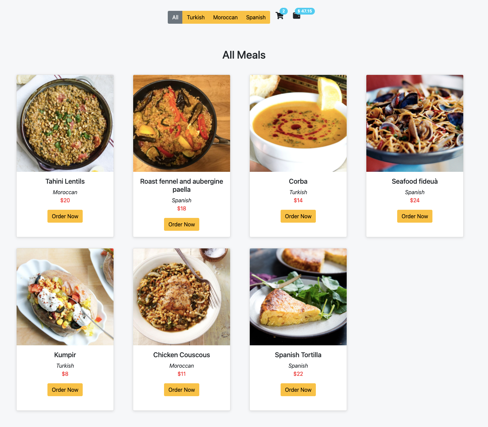

## React Hooks

Hooks allow function components to have access to state and other React features. Because of this, class components are generally no longer needed.

### What Can State Hold?
The `useState` Hook can be used to keep track of `strings`, `numbers`, `booleans`, `arrays`, `objects`, and any combination of these!

We could create multiple state Hooks to track individual values.

### Hook Rules:
There are 3 rules for hooks:

- Hooks can only be called inside React function components.
- Hooks can only be called at the top level of a component.
- Hooks cannot be conditional.

#### Note: `Hooks` will `not work` in React `class` components.

### 1- `useState` Hook:
The React `useState Hook` allows us to `track state in a function component.`

`State`: generally refers to `data or properites that need to be tracking in an application.`

#### Import `useState`:
To use the `useState` Hook, we first need to `import` it into our component.
```js
import { useState } from "react";
```

#### Initialize useState:
We initialize our state by calling `useState` in our function component.

`useState` accepts an `initial state` and returns two values:

- The current state.
- A function that updates the state.

```js
import { useState } from "react";

function FavoriteColor() {
  const [color, setColor] = useState("");
}

```

- The first value, `color`, is our `current state`.
- The second value, `setColor`, is the `fuction that is used to update our state`.
- we set the `initial state` to an `empty string, useState("")`

#### Read State:
We can now include our state anywhere in our component.

```js
import { useState } from "react";

function FavoriteColor() {
  const [color, setColor] = useState("");
   return <h1>My favorite color is {color}!</h1>
}

```

#### Update State:
To update our state, we use our state updater function.

```js
import { useState } from "react";

function FavoriteColor() {
  const [color, setColor] = useState("red");

  return (
    <>
      <h1>My favorite color is {color}!</h1>
      <button
        type="button"
        onClick={() => setColor("blue")}
      >Blue</button>
    </>
  )
}
```

### 2- useEffect Hook:
The `useEffect` Hook allows you to perform `side effects in your components.`

Some examples of side effects are: `fetching data`, `directly updating the DOM`, and `timers`.

useEffect accepts `two arguments`. The `second argument is optional`.

`useEffect(<function>, <dependency>)`

- Think of useEffect Hook as componentDidMount, componentDidUpdate, and componentWillUnmount combined together into one function

#### Import `useEffect`:
```js
import { useEffect } from "react";
```

#### Three ways to pass dependency in `useEffect`:

  - 1- No dependency passed:
    ```js
        useEffect(() => {
         //Runs on every render
        });
    ```

  - 2- An empty array:
    ```js
       useEffect(() => {
        //Runs only on the first render
       }, []);
    ```
  - 3- Props or state values:
    ```js
       useEffect(() => {
        //Runs on the first render
       //And any time any dependency value changes
       }, [prop, state]);
    ```


## Practice Time (extends Meals App Using UseStete Hook)





- `Meals.js`

```js
import React, { useEffect, useState } from "react";
import { meals } from "../mealsData";
import Meal from "./Meal";
import ButtonGroup from 'react-bootstrap/ButtonGroup'
import Button from "react-bootstrap/Button";
import Badge from 'react-bootstrap/Badge'

function Meals() {

  const [mealsList, setmMealsList] = useState(meals)
  const [selectedArea, setSelectedArea] = useState('All Meals')
  const [totalOrders, setTotalOrders] = useState(0);
  const [totalPrice, setTotalPrice] = useState(0);

  useEffect(() => {
    setTotalPrice(t => t * (1 + 0.15))

  }, [totalOrders])


  const Meals = mealsList.map((meal) => <Meal key={meal.idMeal} {...meal} setTotalOrders={setTotalOrders} setTotalPrice={setTotalPrice} />);

  const allMealsHandler = (e) => {
    setmMealsList(meals)
    setSelectedArea(e.target.value)
  }

  const turkishMealsHandler = (e) => {
    const filterdTurkishMeals = meals.filter((meal) => meal.area === "Turkish");
    setmMealsList(filterdTurkishMeals)
    setSelectedArea(e.target.value)

  }

  const moroccanMealsHandler = (e) => {
    const filterdMoroccanMeals = meals.filter((meal) => meal.area === "Moroccan");
    setmMealsList(filterdMoroccanMeals)
    setSelectedArea(e.target.value)
  }

  const spanishMealsHandler = (e) => {
    const filterdSpanishMeals = meals.filter((meal) => meal.area === "Spanish");
    setmMealsList(filterdSpanishMeals)
    setSelectedArea(e.target.value)
  }
  const mystyle = {
    display: "grid",
    padding: "2rem",
    gridTemplateColumns: "1fr 1fr 1fr 1fr",
    gridGap: "2rem",
    alignItems: "center"
  };

  const badgeStyle = {
    transform: 'translate(-1rem,-1rem)'
  }

  return (
    <>
      <div className="d-flex flex-row justify-content-center align-items-center py-3">
        <ButtonGroup className="mb-2 me-3">
          <Button variant="secondary" onClick={allMealsHandler} value="All Meals">All</Button>
          <Button variant="warning" onClick={turkishMealsHandler} value="Turkish Meals">Turkish</Button>
          <Button variant="warning" onClick={moroccanMealsHandler} value="Moroccan Meals">Moroccan</Button>
          <Button variant="warning" onClick={spanishMealsHandler} value="Spanish Meals">Spanish</Button>
        </ButtonGroup>
        <p><i className="fas fa-shopping-cart fa-lg"></i> <Badge pill bg="info" style={badgeStyle}>{totalOrders}</Badge>
        <i className="fas fa-wallet fa-lg"></i><Badge pill bg="info" style={badgeStyle}>$ {totalPrice.toFixed(2)}</Badge>
          </p>
      </div>
      <h2 className="text-center mt-5">{selectedArea}</h2>
      <div style={mystyle}>{Meals}</div>
    </>
  );
}

export default Meals;

```

- `mealsData.js`

```js
export const meals = [
  {
    strMeal: "Tahini Lentils",
    strMealThumb:
      "https://www.themealdb.com/images/media/meals/vpxyqt1511464175.jpg",
    idMeal: "52869",
    area: "Moroccan",
    price: 20
  },
  {
    strMeal: "Roast fennel and aubergine paella",
    strMealThumb: "https://www.themealdb.com/images/media/meals/1520081754.jpg",
    idMeal: "52942",
    area: "Spanish",
    price: 18
  },
  {
    strMeal: "Corba",
    strMealThumb:
      "https://www.themealdb.com/images/media/meals/58oia61564916529.jpg",
    idMeal: "52977",
    area: "Turkish",
    price: 14
  },
  {
    strMeal: "Seafood fideuà",
    strMealThumb:
      "https://www.themealdb.com/images/media/meals/wqqvyq1511179730.jpg",
    idMeal: "52836",
    area: "Spanish",
    price: 24
  },

  {
    strMeal: "Kumpir",
    strMealThumb:
      "https://www.themealdb.com/images/media/meals/mlchx21564916997.jpg",
    idMeal: "52978",
    area: "Turkish",
    price: 8
  },
  {
    strMeal: "Chicken Couscous",
    strMealThumb:
      "https://www.themealdb.com/images/media/meals/qxytrx1511304021.jpg",
    idMeal: "52850",
    area: "Moroccan",
    price: 11
  },
  {
    strMeal: "Spanish Tortilla",
    strMealThumb:
      "https://www.themealdb.com/images/media/meals/quuxsx1511476154.jpg",
    idMeal: "52872",
    area: "Spanish",
    price: 22
  },
];

```

- `Meal.js`

```js
import Card from "react-bootstrap/Card";
import Button from "react-bootstrap/Button";

function Meal({
  strMeal,
  strMealThumb,
  area,
  price,
  setTotalOrders,
  setTotalPrice,
}) {
  return (
    <Card
      style={{
        width: "18rem",
        height: "30rem",
        boxShadow: "rgba(99, 99, 99, 0.2) 0px 2px 8px 0px",
        textAlign: "center",
      }}
    >
      <Card.Img variant="top" src={strMealThumb} />
      <Card.Body>
        <Card.Title>{strMeal}</Card.Title>
        <Card.Text>
          <em>{area}</em> <br />
          <span style={{ color: "red" }}>${price}</span>
        </Card.Text>
        <Button
          variant="warning"
          onClick={() => {
            setTotalOrders((c) => c + 1);
            setTotalPrice((p) => p + price);
          }}
        >
          Order Now
        </Button>
      </Card.Body>
    </Card>
  );
}

export default Meal;
```

Additional Resources:
- [react-hooks w3school](https://www.w3schools.com/react/react_hooks.asp)


