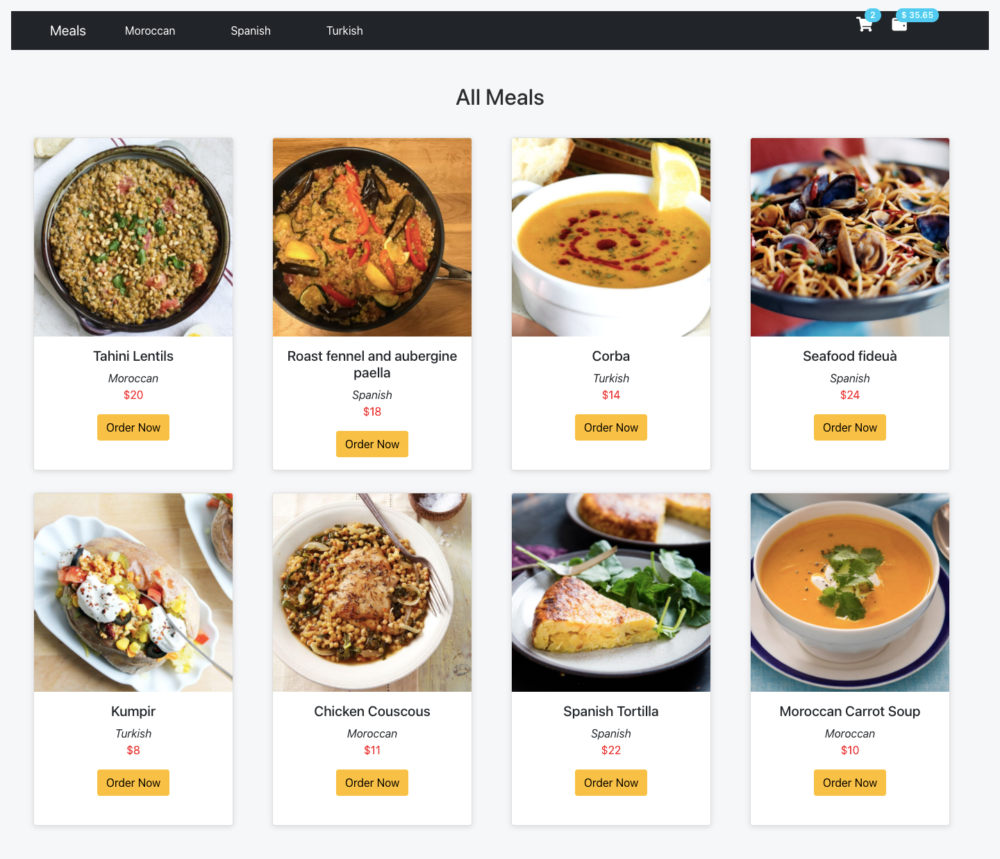
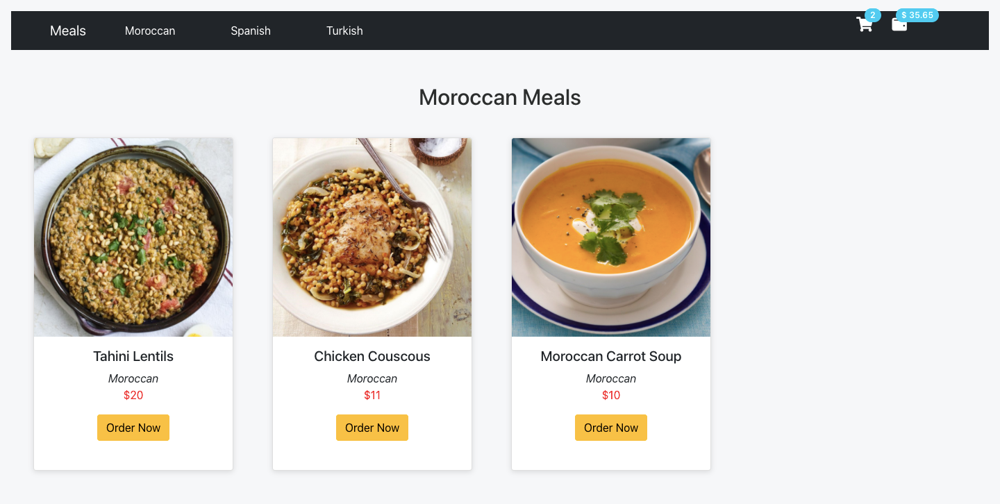

## React Hooks

Hooks allow function components to have access to state and other React features. Because of this, class components are generally no longer needed.

### What Can State Hold?
The `useState` Hook can be used to keep track of `strings`, `numbers`, `booleans`, `arrays`, `objects`, and any combination of these!

We could create multiple state Hooks to track individual values.

### Hook Rules:
There are 3 rules for hooks:

- Hooks can only be called inside React function components.
- Hooks can only be called at the top level of a component.
- Hooks cannot be conditional.

#### Note: `Hooks` will `not work` in React `class` components.

### 1- `useState` Hook:
The React `useState Hook` allows us to `track state in a function component.`

`State`: generally refers to `data or properites that need to be tracking in an application.`

#### Import `useState`:
To use the `useState` Hook, we first need to `import` it into our component.
```js
import { useState } from "react";
```

#### Initialize useState:
We initialize our state by calling `useState` in our function component.

`useState` accepts an `initial state` and returns two values:

- The current state.
- A function that updates the state.

```js
import { useState } from "react";

function FavoriteColor() {
  const [color, setColor] = useState("");
}

```

- The first value, `color`, is our `current state`.
- The second value, `setColor`, is the `fuction that is used to update our state`.
- we set the `initial state` to an `empty string, useState("")`

#### Read State:
We can now include our state anywhere in our component.

```js
import { useState } from "react";

function FavoriteColor() {
  const [color, setColor] = useState("");
   return <h1>My favorite color is {color}!</h1>
}

```

#### Update State:
To update our state, we use our state updater function.

```js
import { useState } from "react";

function FavoriteColor() {
  const [color, setColor] = useState("red");

  return (
    <>
      <h1>My favorite color is {color}!</h1>
      <button
        type="button"
        onClick={() => setColor("blue")}
      >Blue</button>
    </>
  )
}
```

### 2- useEffect Hook:
The `useEffect` Hook allows you to perform `side effects in your components.`

Some examples of side effects are: `fetching data`, `directly updating the DOM`, and `timers`.

useEffect accepts `two arguments`. The `second argument is optional`.

`useEffect(<function>, <dependency>)`

- Think of useEffect Hook as componentDidMount, componentDidUpdate, and componentWillUnmount combined together into one function

#### Import `useEffect`:
```js
import { useEffect } from "react";
```

#### Three ways to pass dependency in `useEffect`:

  - 1- No dependency passed:
    ```js
        useEffect(() => {
         //Runs on every render
        });
    ```

  - 2- An empty array:
    ```js
       useEffect(() => {
        //Runs only on the first render
       }, []);
    ```
  - 3- Props or state values:
    ```js
       useEffect(() => {
        //Runs on the first render
       //And any time any dependency value changes
       }, [prop, state]);
    ```


## Practice Time (extends Meals App Using UseStete Hook)

- From the `meals-router` branch make a new branch called `meals-hooks`

```js
git branch meals-hooks
```

- switch to the branch
```js
git checkout meals-hooks
```





- Your app sturcture should look like this:

```
/meals-app
   /src
    /App.js
    /App.css
    /index.js
    /mealsData.js
    /components
      /Meals.js
      /NavBar.js
      /AllMeals.js
      /MoroccanMeals.js
      /SpanishMeals.js
      /TurkishMeals.js
      /Meal.js  
```
- Add the CDN Fontawsome icons in `index.html` into the `head` section
```html
    <link rel="stylesheet" href="https://use.fontawesome.com/releases/v5.15.4/css/all.css" integrity="sha384-DyZ88mC6Up2uqS4h/KRgHuoeGwBcD4Ng9SiP4dIRy0EXTlnuz47vAwmeGwVChigm" crossorigin="anonymous">

```


- `mealsData.js`

```js
export const meals = [
    {
        strMeal: "Tahini Lentils",
        strMealThumb:
            "https://www.themealdb.com/images/media/meals/vpxyqt1511464175.jpg",
        idMeal: "52869",
        area: "Moroccan",
        price: 20
    },
    {
        strMeal: "Roast fennel and aubergine paella",
        strMealThumb: "https://www.themealdb.com/images/media/meals/1520081754.jpg",
        idMeal: "52942",
        area: "Spanish",
        price: 18
    },
    {
        strMeal: "Corba",
        strMealThumb:
            "https://www.themealdb.com/images/media/meals/58oia61564916529.jpg",
        idMeal: "52977",
        area: "Turkish",
        price: 14
    },
    {
        strMeal: "Seafood fideuà",
        strMealThumb:
            "https://www.themealdb.com/images/media/meals/wqqvyq1511179730.jpg",
        idMeal: "52836",
        area: "Spanish",
        price: 24
    },

    {
        strMeal: "Kumpir",
        strMealThumb:
            "https://www.themealdb.com/images/media/meals/mlchx21564916997.jpg",
        idMeal: "52978",
        area: "Turkish",
        price: 8
    },
    {
        strMeal: "Chicken Couscous",
        strMealThumb:
            "https://www.themealdb.com/images/media/meals/qxytrx1511304021.jpg",
        idMeal: "52850",
        area: "Moroccan",
        price: 11
    },
    {
        strMeal: "Spanish Tortilla",
        strMealThumb:
            "https://www.themealdb.com/images/media/meals/quuxsx1511476154.jpg",
        idMeal: "52872",
        area: "Spanish",
        price: 22
    },
    {
        strMeal: "Moroccan Carrot Soup",
        strMealThumb: "https://www.themealdb.com/images/media/meals/jcr46d1614763831.jpg",
        idMeal: "53047",
        area: "Moroccan",
        price: 10
    },
];

```
- `Meals.js`

```js
import React, { useState, useEffect } from "react";
import Navbar from "./Navbar";
import { meals } from "../mealsData";
import { Route, Switch } from "react-router-dom";
import MoroccanMeals from "./MoroccanMeals";
import AllMeals from "./AllMeals";
import TurkishMeals from "./TurkishMeals";
import SpanishMeals from "./SpanishMeals";

function Meals() {
    const [allMeals, setAllMeals] = useState(meals)
    const [turkishMeals, setTurkishMeals] = useState([])
    const [moroccanMeals, setMoroccanMeals] = useState([])
    const [spanishMeals, setSpanishMeals] = useState([])

    const [totalOrders, setTotalOrders] = useState(0);
    const [totalPrice, setTotalPrice] = useState(0);


    useEffect(() => {
        turkishMealsHandler();
        moroccanMealsHandler();
        spanishMealsHandler();

    }, [])

  const turkishMealsHandler = () => {
    const filterdTurkishMeals = meals.filter((meal) => meal.area === "Turkish");
    setTurkishMeals(filterdTurkishMeals)

  }

  const moroccanMealsHandler = () => {
    const filterdMoroccanMeals = meals.filter((meal) => meal.area === "Moroccan");
    setMoroccanMeals(filterdMoroccanMeals)
  }

  const spanishMealsHandler = () => {
    const filterdSpanishMeals = meals.filter((meal) => meal.area === "Spanish");
    setSpanishMeals(filterdSpanishMeals)
  }

  useEffect(() => {
    setTotalPrice(t => t * (1 + 0.15))

  }, [totalOrders])


    return (
        <>
            <Navbar totalOrders={totalOrders} totalPrice={totalPrice} />

            <Switch>
                <Route exact path="/">
                    <AllMeals meals={allMeals} setTotalOrders={setTotalOrders} setTotalPrice={setTotalPrice}/>
                </Route>
                <Route path="/moroccan">
                    <MoroccanMeals meals={moroccanMeals} setTotalOrders={setTotalOrders} setTotalPrice={setTotalPrice}/>
                </Route>
                <Route path="/turkish">
                    <TurkishMeals meals={turkishMeals} setTotalOrders={setTotalOrders} setTotalPrice={setTotalPrice}/>
                </Route>
                <Route path="/spanish">
                    <SpanishMeals meals={spanishMeals} setTotalOrders={setTotalOrders} setTotalPrice={setTotalPrice}/>
                </Route>
            </Switch>
        </>
    );
}

export default Meals;
```

- `Navbar.js`

```js
import React from "react";
import { Link } from "react-router-dom";
import Navbar from "react-bootstrap/Navbar";
import Nav from "react-bootstrap/Nav";
import Container from "react-bootstrap/Container";
import Badge from 'react-bootstrap/Badge'
function NavBar({totalOrders, totalPrice}) {
    const badgeStyle = {
        transform: 'translate(-1rem,-1rem)'
    }

  return (
    <Navbar bg="dark" expand="lg">
      <Container>
        <Navbar.Brand>
          <Link to="/"> Meals</Link>
        </Navbar.Brand>
        <Navbar.Toggle aria-controls="basic-navbar-nav" />
        <Navbar.Collapse id="basic-navbar-nav">
          <Nav className="me-auto">
            <Nav.Link>
              {" "}
              <Link to="/moroccan"> Moroccan</Link>
            </Nav.Link>
            <Nav.Link>
              <Link to="/spanish"> Spanish</Link>
            </Nav.Link>
            <Nav.Link>
              {" "}
              <Link to="/turkish"> Turkish</Link>
            </Nav.Link>
          </Nav>
        </Navbar.Collapse>
        <p><i className="fas fa-shopping-cart fa-lg"></i> <Badge pill bg="info" style={badgeStyle}>{totalOrders}</Badge>
        <i className="fas fa-wallet fa-lg"></i><Badge pill bg="info" style={badgeStyle}>$ {totalPrice.toFixed(2)}</Badge>
          </p>
      </Container>
    </Navbar>
  );
}

export default NavBar;
```

- `AllMeals.js`
```js
import React from "react";
import Meal from "./Meal";

function AllMeals({ meals, setTotalOrders, setTotalPrice }) {
  const allMeals = meals.map((meal) => <Meal key={meal.idMeal} {...meal} setTotalOrders={setTotalOrders} setTotalPrice={setTotalPrice}/>);
  return (
    <div>
      <h2>All Meals</h2>
      <div className="cards-container">{allMeals}</div>
    </div>
  );
}

export default AllMeals;
```

- `MoroccanMeals.js`
```js
import React from "react";
import Meal from "./Meal";

function MoroccanMeals({ meals, setTotalOrders, setTotalPrice }) {
  const moroccanMeals = meals.filter((meal) => meal.area === "Moroccan");

  const moroccanItems = moroccanMeals.map((meal) => (
    <Meal key={meal.idMeal} {...meal} setTotalOrders={setTotalOrders} setTotalPrice={setTotalPrice}/>
  ));
  return (
    <div>
      <h2>Moroccan Meals</h2>
      <div className="cards-container">{moroccanItems}</div>
    </div>
  );
}

export default MoroccanMeals;
```

- `TurkishMeals.js`
```js
import React from "react";
import Meal from "./Meal";

function TurkishMeals({ meals, setTotalOrders, setTotalPrice }) {
  const turkishMeals = meals.filter((meal) => meal.area === "Turkish");

  const turkishItems = turkishMeals.map((meal) => (
    <Meal key={meal.idMeal} {...meal} setTotalOrders={setTotalOrders} setTotalPrice={setTotalPrice}/>
  ));

  return (
    <div>
      <h2>Turkish Meals</h2>
      <div className="cards-container">{turkishItems}</div>
    </div>
  );
}

export default TurkishMeals;
```

- `SpanishMeals.js`
```js
import React from "react";
import Meal from "./Meal";

function SpanishMeals({ meals, setTotalOrders, setTotalPrice }) {
  const spanishMeals = meals.filter((meal) => meal.area === "Spanish");

  const spanishItems = spanishMeals.map((meal) => (
    <Meal key={meal.idMeal} {...meal} setTotalOrders={setTotalOrders} setTotalPrice={setTotalPrice}/>
  ));

  return (
    <div>
      <h2>Spanish Meals </h2>
      <div className="cards-container">{spanishItems}</div>
    </div>
  );
}

export default SpanishMeals;

```

- `Meal.js`
```js
import React from "react";
import Card from "react-bootstrap/Card";
import Button from "react-bootstrap/Button";

function Meal({ strMeal, strMealThumb, area, price, setTotalOrders, setTotalPrice }) {


  return (
    <Card
      style={{
        width: "18rem",
        height: "30rem",
        boxShadow: "rgba(99, 99, 99, 0.2) 0px 2px 8px 0px",
        textAlign: "center",
      }}
    >
      <Card.Img variant="top" src={strMealThumb} />
      <Card.Body>
        <Card.Title>{strMeal}</Card.Title>
        <Card.Text>
          <em>{area}</em> <br />
          <span style={{ color: "red" }}>${price}</span>
        </Card.Text>
        <Button
          variant="warning"
          onClick={() => {
            setTotalOrders((c) => c + 1);
            setTotalPrice((p) => p + price);
          }}
        >
          Order Now
        </Button>
      </Card.Body>
    </Card>
  );
}

export default Meal;

```


- `App.css`
```css
.meals-container {
  padding: 2rem;
  display: grid;
  grid-template-columns: 1fr 1fr 1fr 1fr;
  grid-gap: 2em;
  align-items: center;
}

.cards-container {
  display: grid;
  padding: 2rem;
  grid-template-columns: 1fr 1fr 1fr 1fr;
  grid-gap: 2rem;
  align-items: center;
}

h2 {
  text-align: center;
  padding-top: 3rem;
  color: rgb(44, 46, 46);
}

a {
  text-decoration: none !important;
  color: rgb(255, 255, 255) !important;
  margin-right: 2rem;
}

a:hover {
  color: rgb(255, 227, 17) !important;
}

i{
  color: white;
}

```

<hr>

Additional Resources:
- [react-hooks w3school](https://www.w3schools.com/react/react_hooks.asp)


