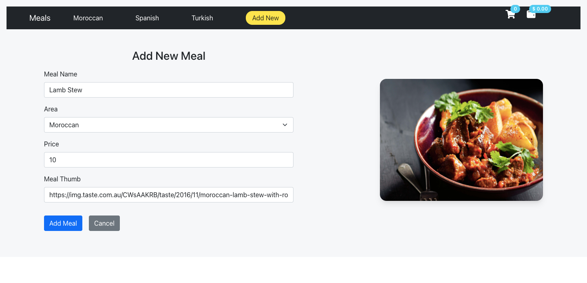

## Updating State:
### Updating Objects/Arrays in State:
State can hold any kind of JavaScript value, including objects. But you shouldn’t change objects that you hold in the React state directly. Instead, when you want to update an object, you need to create a new one (or make a copy of an existing one), and then set the state to use that copy.

Arrays are another type of mutable JavaScript objects you can store in state and should treat as immutable.

- Copying objects/arrays with the `spread` `(...)` syntax:
update only the field that changed for example(changed in a form), but keep the previous values for all other fields.

```js
// for objects
const [state, setState] = useState({})
          .
          .
          .
//inside a handler
setState({
  ...state, // Copy the old fields
  feild: e.target.value // But override this one
})
```

```js
// for arrays
const [state, setState] = useState([])
          .
          .
          .
//inside a handler
setState([
  ...state, // Copy the old fields
  feild: e.target.value // But override this one
])
```
## React Forms
Just like in HTML, React uses forms to allow users to interact with the web page.

### Handling Forms
 - Handling forms is about how you handle the data when it changes value or gets submitted.

 - In React, form data is usually handled by the components.

 - When the data is handled by the components, all the data is stored in the component state.

 - You can control changes by adding event handlers in the `onChange` attribute.

  - We can use the `useState` Hook to keep track of each inputs value and provide a "single source of truth" for the entire application.
  
## Practice Time (extends Meals App to implement CRUD operations)

- From the `meals-hooks` branch make a new branch called `meals-crud`

```js
git branch meals-crud
```

- switch to the branch
```js
git checkout meals-crud
```





- Your app sturcture should look like this:

```
/meals-app
   /src
    /App.js
    /App.css
    /index.js
    /mealsData.js
    /components
      /Meals.js
      /NavBar.js
      /AllMeals.js
      /MoroccanMeals.js
      /SpanishMeals.js
      /TurkishMeals.js
      /Meal.js  
      /NewMeal.js
      /EditMeal.js
```
- Make a `forms` to Add/Edit Meals.
- Make `Add`/`Edit`/`Delete` Functionalities.
- Update Components as required.
- Use `uuid` to generate an id when creating new Meal.

  - install:
  ```js
  npm install uuid
  ```
  - import:
  ```js
  import { v4 as uuidv4 } from 'uuid';
  ```
  - use:
  ```js
  id: uuidv4()
  ```

- Use `sweetalert2` to show beautiful, responsive, customizable popup boxes

  - install:
  ```js
  npm install sweetalert2
  ```
  - import:
  ```js
  import Swal from 'sweetalert2';
  ```


- `Meals.js`

```js
import React, { useState, useEffect } from "react";
import Navbar from "./Navbar";
import { meals } from "../mealsData";
import { Route, Switch } from "react-router-dom";
import MoroccanMeals from "./MoroccanMeals";
import AllMeals from "./AllMeals";
import TurkishMeals from "./TurkishMeals";
import SpanishMeals from "./SpanishMeals";
import NewMeal from "./NewMeal";
import EditMeal from "./EditMeal";
import Swal from "sweetalert2";

function Meals() {

  //(childern)اللي راح يتم استخدامها بواسطة ال(sates) هنا يتم تعريف كل ال
  
  // وداخلها راح نضيف/نعدل/نحذف(states) علشان تصير هي الاساس واللي راح نشتق منها باقي ال(state)نحتاج هذه ال
  const [allMeals, setAllMeals] = useState(meals);

  //   تحتوي على الوجبات التركية(state) هذه ال
  const [turkishMeals, setTurkishMeals] = useState([]);

  //   تحتوي على الوجبات المغربية(state) هذه ال
  const [moroccanMeals, setMoroccanMeals] = useState([]);

  //   تحتوي على الوجبات الاسبانية(state) هذه ال
  const [spanishMeals, setSpanishMeals] = useState([]);

  //  (card)تحتوي على الوجبة اللي راح يختارها اليوزر علشان يعدل فيها / اذا ضغط ايقونه التعديل على ال    (state) هذه ال
  const [selectedMeal, setSelectedMeal] = useState({});

  //     تتغير order nowعلى مجموع الطلبات اللي طلبها اليوزر / كل مايضغط على زر  (state) هذه ال
  const [totalOrders, setTotalOrders] = useState(0);
  
  //     تتغير order nowعلى مجموع الاسعار للطلبات اللي طلبها اليوزر / كل مايضغط على زر  (state) هذه ال
  const [totalPrice, setTotalPrice] = useState(0);

  // (مثلا لو اليوزر ضاف وجبة جديده/حذف/او عدل بيانات) لانه تراقب التغييرات عليها allMeals state  يعني اول مايصير رندر للكومبوننت راح تشتغل ، كمان لو تغيرت قيمة ال componentDidUpdate() + componentDidMount()تشتغل مثل عمل 
  useEffect(() => {
    turkishMealsHandler();
    moroccanMealsHandler();
    spanishMealsHandler();
  }, [allMeals]);

  //فانكشن تعمل فلتر على كل الوجبات علشان ترجع الوجبات التركية بس وتضيفها داخل الاستيت المناسبه
  const turkishMealsHandler = () => {
    const filterdTurkishMeals = allMeals.filter(
      (meal) => meal.area === "Turkish"
    );
    setTurkishMeals(filterdTurkishMeals);
  };

  //فانكشن تعمل فلتر على كل الوجبات علشان ترجع الوجبات المغربية بس وتضيفها داخل الاستيت المناسبه
  const moroccanMealsHandler = () => {
    const filterdMoroccanMeals = allMeals.filter(
      (meal) => meal.area === "Moroccan"
    );
    setMoroccanMeals(filterdMoroccanMeals);
  };

  //فانكشن تعمل فلتر على كل الوجبات علشان ترجع الوجبات الاسبانية بس وتضيفها داخل الاستيت المناسبه
  const spanishMealsHandler = () => {
    const filterdSpanishMeals = allMeals.filter(
      (meal) => meal.area === "Spanish"
    );
    setSpanishMeals(filterdSpanishMeals);
  };

  // تشتغل اذا تغيرت قيمة الاستيت تبع الطلبات علشان تضيف قيمة ضريبة
  useEffect(() => {
    setTotalPrice((t) => t * (1 + 0.15));
  }, [totalOrders]);


  //تبع الوجبة اللي يريد يعدل فيها idفانشكن تشتغل اذا اليوزر ضغط على ايقونة التعديل ، راح تستقبل 
  //EditMeal.js form لاننا نحتاجها داخل  selectedMeal state  بين الوجبات كلها وبعدين تضيف الوجبة داخل id علشان تبحث عن ال find بعدين راح تستخدم دالة 
  const handleMealEdit = (id) => {
    const mealToEdit = allMeals.find((meal) => meal.idMeal === id);
    setSelectedMeal(mealToEdit);
  };

  // NewMeal.js form فانكشن تعمل اضافة للوجبة الجديدة اللي ضافها اليوزر في 
  //يحتوي على تفاصيل الوجبة الجديدة mealتستقبل برامتر عبارة عن اوبجيكت 
  const addNewMeal = (meal) => {
    //اضافة الوجبة الجديدة اولاً بالاضافه انه نرجع محتويات الاستيت القديمة => مهم 
    //الوجبة الجديدة تكون اول شي بالاري/ الاستيت
    setAllMeals([meal, ...allMeals]);
  };

  // فانشكن تعمل تعديل لوجبة موجودة مسبقاً ، تشتغل على خطوتين
  // id ونضيف الجديدة على نفس الid١- تسوي فلتر لكل الوجبات وترجعهم كلهم ماعدا الوجبة الحالية ، طيب ليش؟ لانه حابين نحذف القديمة اللي بنفس ال
  //٢-  وبعدين نضيفها بالاستيت
  const editMeal = (meal) => {
    const filterdMeals = allMeals.filter(
      (filterdMeal) => filterdMeal.idMeal !== meal.idMeal
    );
    setAllMeals([meal, ...filterdMeals]);
  };

  // idفانشكن تحذف الوجبة اذا ضغط اليوزر على ايقونه الحذف ، تحذف بناءً على ال
  const deleteMeal = (id) => {
    Swal.fire({
      title: "Are you sure?",
      text: "You won't be able to revert this!",
      icon: "warning",
      showCancelButton: true,
      confirmButtonColor: "#3085d6",
      cancelButtonColor: "#d33",
      confirmButtonText: "Yes, delete it!",
    }).then((result) => {
      if (result.isConfirmed) {
        const filterdMeals = allMeals.filter(
          (filterdMeal) => filterdMeal.idMeal !== id
        );
        setAllMeals(filterdMeals);
        Swal.fire("Deleted!", "The selected Meal has been deleted.", "success");
      }
    });
  };

  return (
    <>
      <Navbar totalOrders={totalOrders} totalPrice={totalPrice} />
      <Switch>
        <Route exact path="/">
          <AllMeals
            meals={allMeals}
            setTotalOrders={setTotalOrders}
            setTotalPrice={setTotalPrice}
            handleMealEdit={handleMealEdit}
            deleteMeal={deleteMeal}
          />
        </Route>
        <Route path="/moroccan">
          <MoroccanMeals
            meals={moroccanMeals}
            setTotalOrders={setTotalOrders}
            setTotalPrice={setTotalPrice}
            handleMealEdit={handleMealEdit}
            deleteMeal={deleteMeal}
          />
        </Route>
        <Route path="/turkish">
          <TurkishMeals
            meals={turkishMeals}
            setTotalOrders={setTotalOrders}
            setTotalPrice={setTotalPrice}
            handleMealEdit={handleMealEdit}
            deleteMeal={deleteMeal}
          />
        </Route>
        <Route path="/spanish">
          <SpanishMeals
            meals={spanishMeals}
            setTotalOrders={setTotalOrders}
            setTotalPrice={setTotalPrice}
            handleMealEdit={handleMealEdit}
            deleteMeal={deleteMeal}
          />
        </Route>
        <Route path="/newMeal">
          <NewMeal addNewMeal={addNewMeal} />
        </Route>
        <Route path="/EditMeal">
          <EditMeal selectedMeal={selectedMeal} editMeal={editMeal} />
        </Route>
      </Switch>
    </>
  );
}

export default Meals;

```

- `Navbar.js`

```js
import React from "react";
import { Link } from "react-router-dom";
import Navbar from "react-bootstrap/Navbar";
import Nav from "react-bootstrap/Nav";
import Container from "react-bootstrap/Container";
import Badge from "react-bootstrap/Badge";
function NavBar({ totalOrders, totalPrice }) {
  const badgeStyle = {
    transform: "translate(-1rem,-1rem)",
  };

  return (
    <Navbar bg="dark" expand="lg" className="navs">
      <Container>
        <Navbar.Brand>
          <Link to="/"> Meals</Link>
        </Navbar.Brand>
        <Navbar.Toggle aria-controls="basic-navbar-nav" />
        <Navbar.Collapse id="basic-navbar-nav">
          <Nav className="me-auto">
            <Nav.Link>
              {" "}
              <Link to="/moroccan"> Moroccan</Link>
            </Nav.Link>
            <Nav.Link>
              <Link to="/spanish"> Spanish</Link>
            </Nav.Link>
            <Nav.Link>
              {" "}
              <Link to="/turkish"> Turkish</Link>
            </Nav.Link>
            <Nav.Link>
              {" "}
              <Link id="newMeal" to="/newMeal">
                {" "}
                Add New
              </Link>
            </Nav.Link>
          </Nav>
        </Navbar.Collapse>
        <p>
          <i className="fas fa-shopping-cart fa-lg"></i>{" "}
          <Badge pill bg="info" style={badgeStyle}>
            {totalOrders}
          </Badge>
          <i className="fas fa-wallet fa-lg"></i>
          <Badge pill bg="info" style={badgeStyle}>
            $ {totalPrice.toFixed(2)}
          </Badge>
        </p>
      </Container>
    </Navbar>
  );
}

export default NavBar;

```

- `AllMeals.js`
```js
import React from "react";
import Meal from "./Meal";

function AllMeals({
  meals,
  setTotalOrders,
  setTotalPrice,
  handleShowEditForm,
  deleteMeal,
}) {
  const allMeals = meals.map((meal) => (
    <Meal
      key={meal.idMeal}
      {...meal}
      setTotalOrders={setTotalOrders}
      setTotalPrice={setTotalPrice}
      handleShowEditForm={handleShowEditForm}
      deleteMeal={deleteMeal}
    />
  ));
  return (
    <div>
      <h2>All Meals</h2>
      <div className="cards-container">{allMeals}</div>
    </div>
  );
}

export default AllMeals;

```

- `MoroccanMeals.js`
```js
import React from "react";
import Meal from "./Meal";

function MoroccanMeals({
  meals,
  setTotalOrders,
  setTotalPrice,
  handleShowEditForm,
  deleteMeal,
}) {
  const moroccanItems = meals.map((meal) => (
    <Meal
      key={meal.idMeal}
      {...meal}
      setTotalOrders={setTotalOrders}
      setTotalPrice={setTotalPrice}
      handleShowEditForm={handleShowEditForm}
      deleteMeal={deleteMeal}
    />
  ));
  return (
    <div>
      <h2>Moroccan Meals</h2>
      <div className="cards-container">{moroccanItems}</div>
    </div>
  );
}

export default MoroccanMeals;

```

- `TurkishMeals.js`
```js
import React from "react";
import Meal from "./Meal";

function TurkishMeals({
  meals,
  setTotalOrders,
  setTotalPrice,
  handleShowEditForm,
  deleteMeal,
}) {
  const turkishItems = meals.map((meal) => (
    <Meal
      key={meal.idMeal}
      {...meal}
      setTotalOrders={setTotalOrders}
      setTotalPrice={setTotalPrice}
      handleShowEditForm={handleShowEditForm}
      deleteMeal={deleteMeal}
    />
  ));

  return (
    <div>
      <h2>Turkish Meals</h2>
      <div className="cards-container">{turkishItems}</div>
    </div>
  );
}

export default TurkishMeals;

```

- `SpanishMeals.js`
```js
import React from "react";
import Meal from "./Meal";

function SpanishMeals({
  meals,
  setTotalOrders,
  setTotalPrice,
  handleShowEditForm,
  deleteMeal,
}) {
  const spanishItems = meals.map((meal) => (
    <Meal
      key={meal.idMeal}
      {...meal}
      setTotalOrders={setTotalOrders}
      setTotalPrice={setTotalPrice}
      handleShowEditForm={handleShowEditForm}
      deleteMeal={deleteMeal}
    />
  ));

  return (
    <div>
      <h2>Spanish Meals </h2>
      <div className="cards-container">{spanishItems}</div>
    </div>
  );
}

export default SpanishMeals;

```

- `Meal.js`
```js
import React from "react";
import Card from "react-bootstrap/Card";
import Button from "react-bootstrap/Button";
import { Link } from "react-router-dom";

function Meal({
  idMeal,
  strMeal,
  strMealThumb,
  area,
  price,
  setTotalOrders,
  setTotalPrice,
  handleShowEditForm,
  deleteMeal,
}) {
  return (
    <Card
      style={{
        width: "18rem",
        height: "30rem",
        boxShadow: "rgba(99, 99, 99, 0.2) 0px 2px 8px 0px",
        textAlign: "center",
      }}
    >
      <div className="actions">
        <i className="fas fa-times" onClick={() => deleteMeal(idMeal)}></i>
        <Link to="/EditMeal">
          {" "}
          <i
            className="far fa-edit"
            onClick={() => handleShowEditForm(idMeal)}
          ></i>
        </Link>
      </div>
      <div className="img-container">
      <Card.Img variant="top" src={strMealThumb} className="img"/>
      </div>
      <Card.Body>
        <Card.Title>{strMeal}</Card.Title>
        <Card.Text>
          <em>{area}</em> <br />
          <span style={{ color: "red" }}>${price}</span>
        </Card.Text>
        <Button
          variant="warning"
          onClick={() => {
            setTotalOrders((c) => c + 1);
            setTotalPrice((p) => p + price);
          }}
        >
          Order Now
        </Button>
      </Card.Body>
    </Card>
  );
}

export default Meal;

```

- `NewMeal.js`
```js
import React, { useState } from "react";
import Container from "react-bootstrap/Container";
import Form from "react-bootstrap/Form";
import Button from "react-bootstrap/Button";
import { v4 as uuidv4 } from "uuid";
import Swal from "sweetalert2";
import {useHistory} from 'react-router-dom'

function NewMeal(props) {
  const history = useHistory()
  const [meal, setMeal] = useState({});

  const handleChange = (e) => {
    const { name, value } = e.target;
    setMeal({
      ...meal,
      idMeal: uuidv4(),
      [name]: value,
    });
  };

  const validate = () => {
    const strMeal = document.getElementById("strMeal").value;
    const area = document.getElementById("area").value;
    const price = document.getElementById("price").value;
    const strMealThumb = document.getElementById("strMealThumb").value;

    if (!strMeal || !area || !price || !strMealThumb) {
      Swal.fire("Empty", "Some Feilds are empty!", "error");
      return false;
    } else {
      return true;
    }
  };

  const submitHandler = (e) => {
    e.preventDefault();

    if (JSON.stringify(meal) === "{}") {
      Swal.fire("Oops!", "You should add the Meal details first", "warning");
    } else {
      if (validate()) {
        props.addNewMeal(meal);
        e.target.reset();
        history.push("/");
        Swal.fire(
          "Meal Added!",
          "Congratulations Meal has been added",
          "success"
        );
      }
    }
  };

  const imgStr = meal.strMealThumb
    ? meal.strMealThumb
    : "https://cdn2.iconfinder.com/data/icons/cafeteria-1/256/combo-512.png";

  return (
    <Container className="p-5">
      <div className="inner-container">
        <Form onSubmit={submitHandler}>
          <h3 className="mb-3 text-center">Add New Meal</h3>
          <Form.Group className="mb-3">
            <Form.Label>Meal Name </Form.Label>
            <Form.Control
              id="strMeal"
              name="strMeal"
              type="text"
              placeholder="Enter Meal Name "
              onChange={handleChange}
            />
          </Form.Group>

          <Form.Group className="mb-3">
            <Form.Label>Area</Form.Label>{" "}
            <Form.Select  id="area"
              name="area" onChange={handleChange}>
              <option value="">Select Area</option>
              <option value="Moroccan">Moroccan</option>
              <option value="Turkish">Turkish</option>
              <option value="Spanish">Spanish</option>
            </Form.Select>
          </Form.Group>

          <Form.Group className="mb-3">
            <Form.Label>Price</Form.Label>{" "}
            <Form.Control
              id="price"
              name="price"
              type="number"
              min="1"
              placeholder="Enter Meal Price"
              onChange={handleChange}
            />{" "}
          </Form.Group>

          <Form.Group className="mb-3">
            <Form.Label>Meal Thumb</Form.Label>{" "}
            <Form.Control
              id="strMealThumb"
              name="strMealThumb"
              type="url"
              placeholder="Enter Meal Pic"
              onChange={handleChange}
            />{" "}
          </Form.Group>

          <Button variant="primary" type="submit" className="mt-3 me-3">
            Add Meal
          </Button>
          <Button
            variant="secondary"
            onClick={() => history.push("/")}
            className="mt-3 me-3"
          >
            Cancel
          </Button>
        </Form>
        
      </div>
    </Container>
  );
}

export default NewMeal;

```
- `EditMeal.js`
```js
import React, { useState } from "react";
import Container from "react-bootstrap/Container";
import Form from "react-bootstrap/Form";
import Button from "react-bootstrap/Button";
import Swal from "sweetalert2";
import {useHistory} from 'react-router-dom'

function EditMeal(props) {
  const history = useHistory()
  const [meal, setMeal] = useState(props.selectedMeal);

  const handleChange = (e) => {
    const { name, value } = e.target;
    setMeal({
      ...meal,
      [name]: value,
    });
  };

  const validate = () => {
    const strMeal = document.getElementById("strMeal").value;
    const area = document.getElementById("area").value;
    const price = document.getElementById("price").value;
    const strMealThumb = document.getElementById("strMealThumb").value;

    if (!strMeal || !area || !price || !strMealThumb) {
      Swal.fire("Empty", "Some Feilds are empty!", "error");
      return false;
    } else {
      return true;
    }
  };

  const submitHandler = (e) => {
    e.preventDefault();

    if (JSON.stringify(meal) === "{}") {
      Swal.fire("Oops!", "You should add the Meal details first", "warning");
    } else {
      if (validate()) {
        props.editMeal(meal);
        e.target.reset();
        history.push("/");
        Swal.fire(
          "Meal Updated!",
          "Congratulations Meal has been Updated",
          "success"
        );
      }
    }
  };
  const imgStr = meal.strMealThumb
    ? meal.strMealThumb
    : "https://cdn2.iconfinder.com/data/icons/cafeteria-1/256/combo-512.png";

  return (
    <Container className="p-5">
      <div className="inner-container">
        <Form onSubmit={submitHandler}>
          <h3 className="mb-3 text-center">Edit Meal</h3>
          <Form.Group className="mb-3">
            <Form.Label>Meal Name </Form.Label>
            <Form.Control
              id="strMeal"
              name="strMeal"
              type="text"
              value={meal.strMeal}
              placeholder="Enter Meal Name "
              onChange={handleChange}
            />
          </Form.Group>

          <Form.Group className="mb-3">
            <Form.Label>Area</Form.Label>{" "}
            <Form.Select
              id="area"
              name="area"
              value={meal.area}
              onChange={handleChange}
            >
              <option value="">Select Area</option>
              <option value="Moroccan">Moroccan</option>
              <option value="Turkish">Turkish</option>
              <option value="Spanish">Spanish</option>
            </Form.Select>
          </Form.Group>

          <Form.Group className="mb-3">
            <Form.Label>Price</Form.Label>{" "}
            <Form.Control
              id="price"
              name="price"
              type="number"
              min="1"
              value={meal.price}
              placeholder="Enter Meal Price"
              onChange={handleChange}
            />{" "}
          </Form.Group>

          <Form.Group className="mb-3">
            <Form.Label>Meal Thumb</Form.Label>{" "}
            <Form.Control
              id="strMealThumb"
              name="strMealThumb"
              type="url"
              value={meal.strMealThumb}
              placeholder="Enter Meal Pic"
              onChange={handleChange}
            />{" "}
          </Form.Group>

          <Button variant="primary" type="submit" className="mt-3 me-3">
            Edit Meal
          </Button>
          <Button
            variant="secondary"
            onClick={() => history.push("/")}
            className="mt-3 me-3"
          >
            Cancel
          </Button>
        </Form>
        
      </div>
    </Container>
  );
}

export default EditMeal;

```

- `App.css`
```css
.meals-container {
  padding: 2rem;
  display: grid;
  grid-template-columns: 1fr 1fr 1fr 1fr;
  grid-gap: 2em;
  align-items: center;
}

.cards-container {
  display: grid;
  padding: 2rem;
  grid-template-columns: 1fr 1fr 1fr 1fr;
  grid-gap: 2rem;
  align-items: center;
}

h2 {
  text-align: center;
  padding-top: 3rem;
  color: rgb(44, 46, 46);
}

.navs a {
  text-decoration: none !important;
  color: rgb(255, 255, 255) !important;
  margin-right: 2rem;
}

a:hover {
  color: rgb(255, 227, 17) !important;
}

i {
  color: white;
}

a#newMeal {
  background-color: rgb(255, 227, 17);
  padding: 0.5rem 1rem;
  border-radius: 1rem;
  color: rgb(44, 46, 46) !important;
}

a#newMeal:hover {
  background-color: rgb(255, 204, 0);
}

.img-container {
  height: 15rem;
  width: 100%;
}

.img {
  height: 100%;
  object-fit: cover;
}

.actions {
  height: 8rem;
  width: 3rem;
  padding: 0 0.6rem;
  position: absolute;
  background-color: rgba(55, 55, 54, 0.619);
  display: flex;
  flex-direction: column;
  justify-content: space-around;
  align-items: center;
}

.actions i {
  color: rgb(255, 225, 0);
}

.actions i:hover {
  color: rgb(255, 225, 0);
  transform: scale(1.3);
}

.fa-times:hover {
  color: rgb(255, 77, 0) !important;
}

.fa-edit:hover {
  color: rgb(0, 166, 255) !important;
}

form {
  width: 50%;
}
.inner-container {
  display: flex;
  flex-direction: row;
  justify-content: space-between;
  align-items: center;
}

.inner-container img {
  border-radius: 1rem;
  border: none;
  box-shadow: rgba(0, 0, 0, 0.1) 0px 10px 15px -3px,
    rgba(0, 0, 0, 0.05) 0px 4px 6px -2px;
}

```

<hr>

Additional Resources:
- [uuid](https://github.com/uuidjs/uuid#readme)
- [sweetalert2](https://sweetalert2.github.io/#download)


