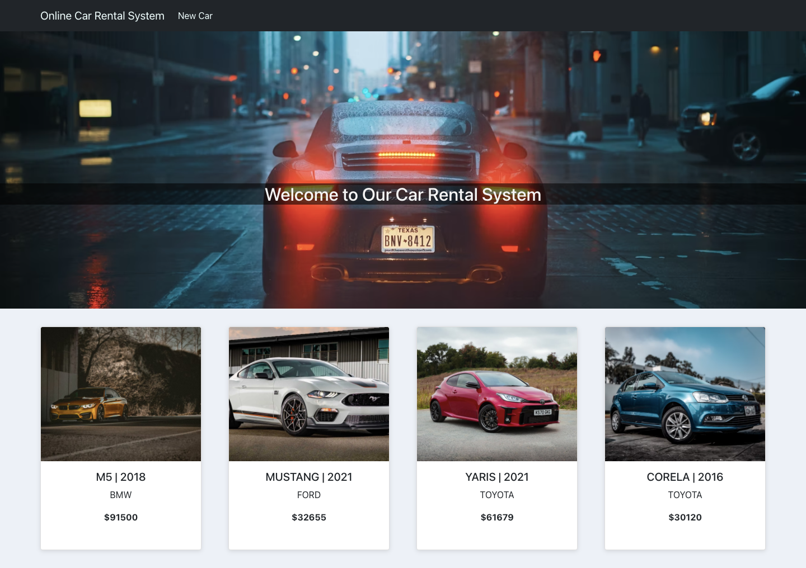
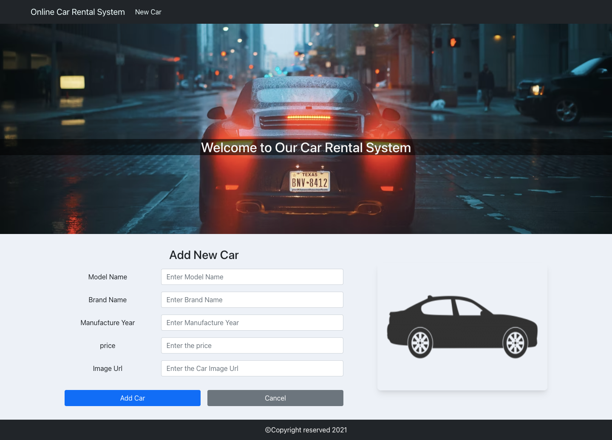
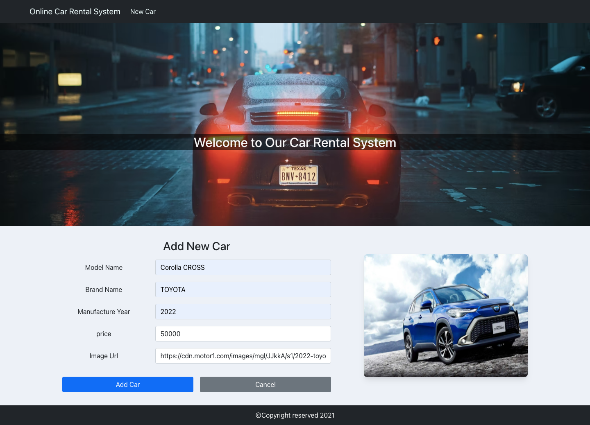
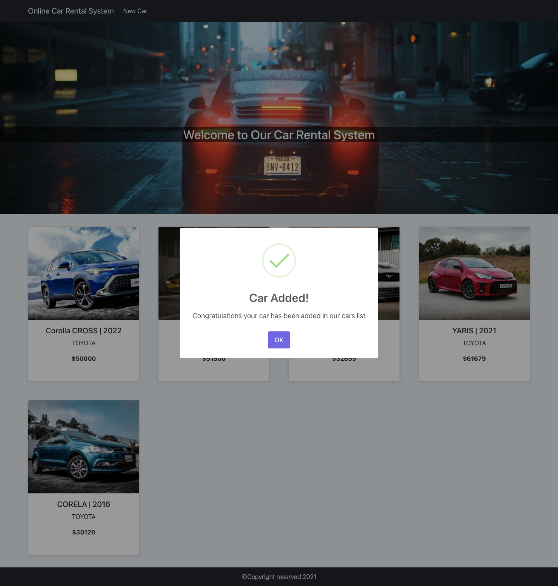
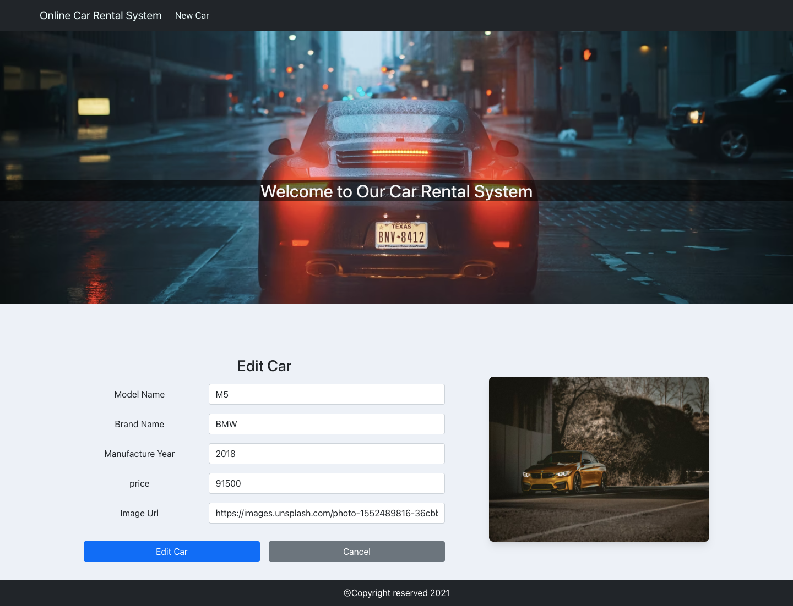
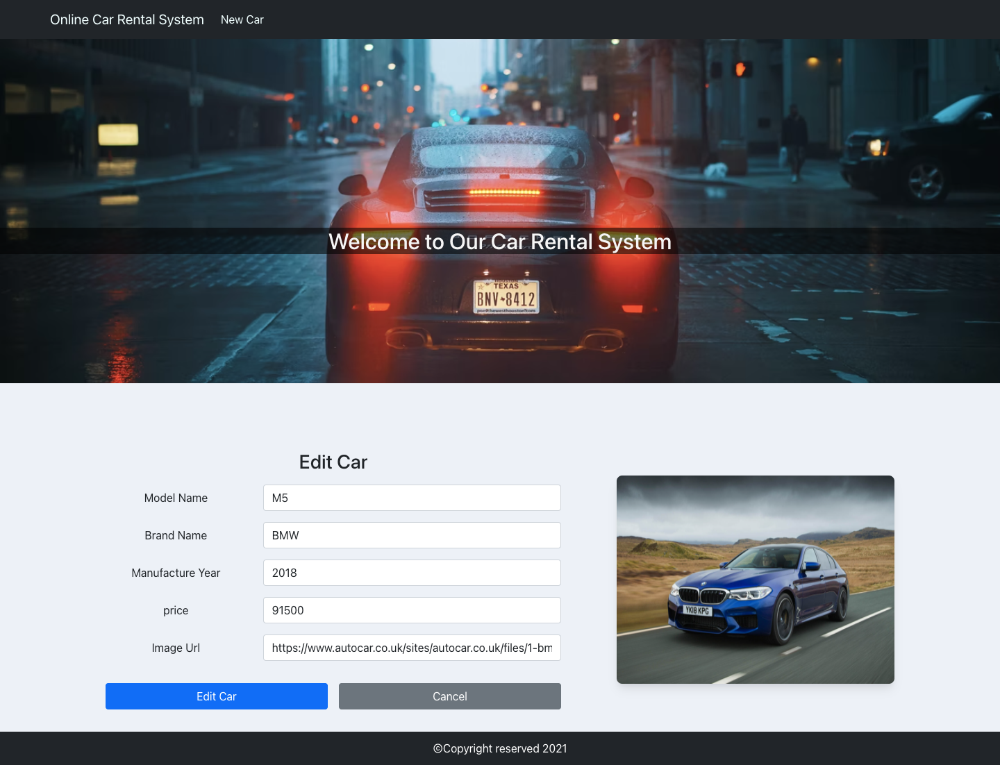
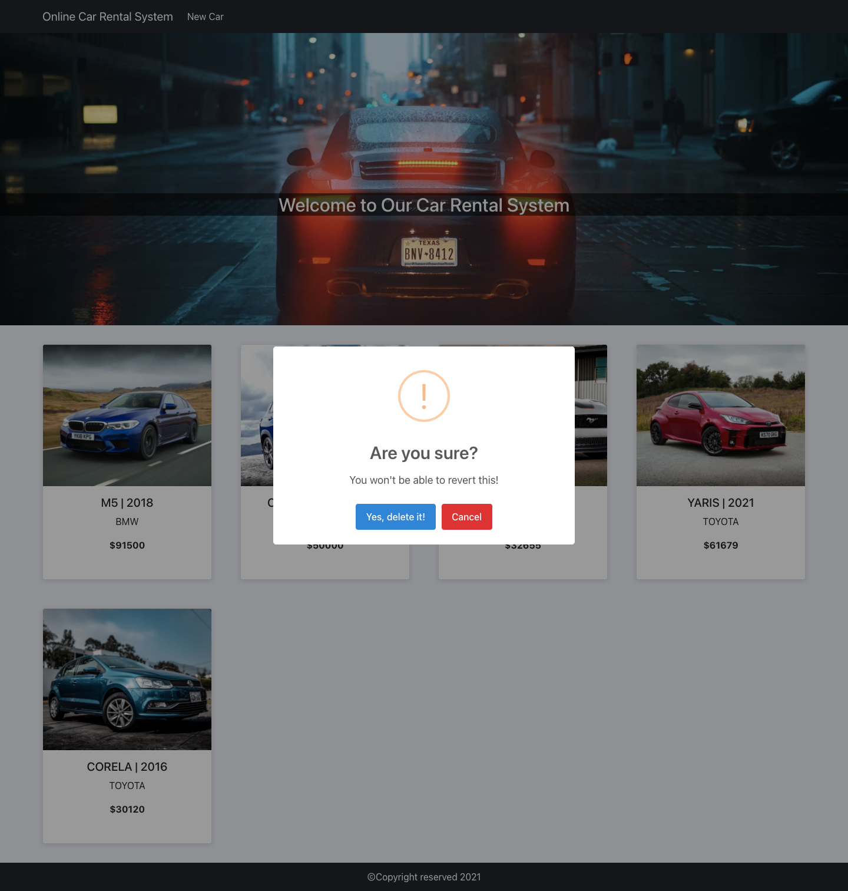
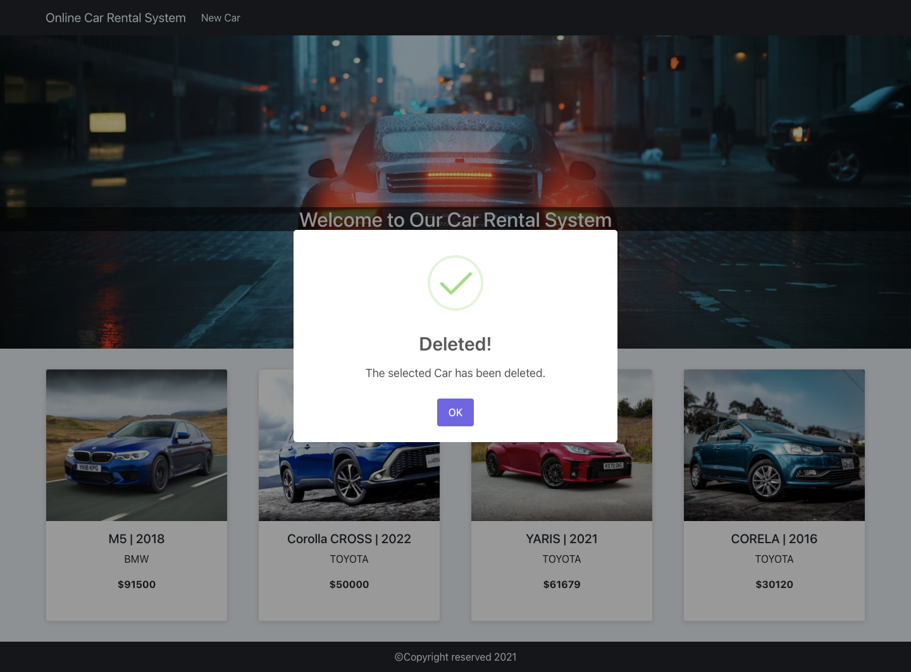
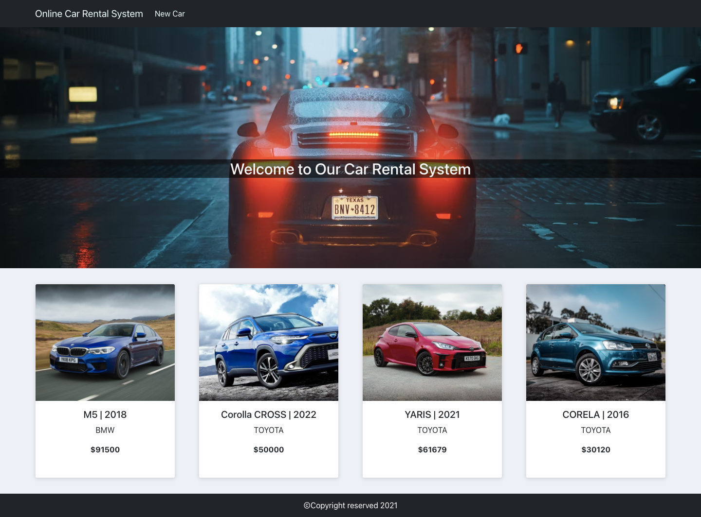

## Context API
`Context API` provides a way to `share data` between components `without` `explicitly passing props through every level of the component tree.`

- Passing down props can be cumbersome when they are required by many components in the hierarchy.

- Use it when you want to share data that can be considered `“global”` for a tree of React components
  - Ex: User information, Theme, Browser history, current authenticated user, preferred language.

### 1- Initializing Context:
Use `React.createContext` to create a new context object

```js
const MyThemeContext = React.createContext("light");
```

### 2- Providing Context:
- We need a context provider to make the context available to all our React components.
- This provider lets consuming components to subscribe to context changes.
- `Context.Provider` is used to provide the context. It accepts a `value prop `which `can be passed` to the consuming components.
```js
function MyComponent() {
  const theme = "light";
  return (
    <MyThemeContext.Provider value={theme}>
      <div>
        my component
      </div>
    </MyThemeContext.Provider>
); }
```

### 3- Consuming Context:
- A Consumer component subscribes to context changes within a function component.

- Consuming context with `functional components` is `easier` and `less verbose` We just have to use a hook called `useContext`
  - It accepts a context object.
  - It returns the current context value for that context.

```js
const Main = () => {
  const currentTheme = useContext(MyThemeContext);
  return(
    <Button theme={currentTheme} />
); }
```
- `useContext(MyThemeContext)` only lets you `read the context and subscribe to its changes.`

  
## Practice Time (Online Car Rental System Project - 2)

- Using Context concept implement CRUD App.













- Your app sturcture should look like this:

```
/car-rental-app
   /src
    /App.js
    /App.css
    /index.js
    /components
      /CarContext.js
      /NavBar.js
      /CarsList.js
      /CarCard.js
      /NewCar.js
      /EditCar.js 
      /Footer.js
```
- Make a `forms` to Add/Edit Cars.
- Make `Add`/`Edit`/`Delete` Functionalities.
- Use `uuid` to generate an id when creating new Meal.

  - install:
  ```js
  npm install uuid
  ```
  - import:
  ```js
  import { v4 as uuidv4 } from 'uuid';
  ```
  - use:
  ```js
  id: uuidv4()
  ```

- Use `sweetalert2` to show beautiful, responsive, customizable popup boxes

  - install:
  ```js
  npm install sweetalert2
  ```
  - import:
  ```js
  import Swal from 'sweetalert2';
  ```

- Add the CDN Fontawsome icons in `index.html` into the `head` section
```html
    <link rel="stylesheet" href="https://use.fontawesome.com/releases/v5.15.4/css/all.css" integrity="sha384-DyZ88mC6Up2uqS4h/KRgHuoeGwBcD4Ng9SiP4dIRy0EXTlnuz47vAwmeGwVChigm" crossorigin="anonymous">

```

- Use react bootstrap for rapid design
  - instaltion:
    ```
     npm install react-bootstrap bootstrap
    ```
  - In the index.js (the root component) add the import below:
    ```
     import 'bootstrap/dist/css/bootstrap.min.css';
     ```
- `index.js`

```js
import React from 'react';
import ReactDOM from 'react-dom';
import './index.css';
import App from './App';
import 'bootstrap/dist/css/bootstrap.min.css';
import { BrowserRouter as Router } from 'react-router-dom';

ReactDOM.render(
  <React.StrictMode>
    <Router>
    <App />
    </Router>
  </React.StrictMode>,
  document.getElementById('root')
);

```

- `App.js`

```js
import logo from "./logo.svg";
import "./App.css";
import NavBar from "./components/NavBar";
import { Route, Switch } from "react-router-dom";
import CarsList from "./components/CarsList";
import { CarProvider } from "./components/CarContext";
import NewCar from "./components/NewCar";

function App() {
  return (
    <CarProvider>
      <div className="main-container">
        <NavBar />
        <div className="heading">
          <h2>Welcome to Our Car Rental System</h2>
        </div>
      </div>
      <Switch>
        <Route exact path="/" component={CarsList} />
        <Route path="/newCar" component={NewCar} />
      </Switch>
    </CarProvider>
  );
}

export default App;

```

- `CarContext.js`
```js
import React, { useState, createContext } from "react";

export const CarContext = createContext();

export const CarProvider = (props) => {
  const [cars, setCars] = useState([
    {
      id: "ba452134-5a70-4530-b76f-965724953b1c",
      modelName: "M5",
      brandName: "BMW",
      price: 91_500,
      manufactureYear: "2018",
      carUrl:
        "https://images.unsplash.com/photo-1552489816-36cbb35b47e8?ixid=MnwxMjA3fDB8MHxwaG90by1wYWdlfHx8fGVufDB8fHx8&ixlib=rb-1.2.1&auto=format&fit=crop&w=870&q=80",
    },
    {
      id: "ba452134-5abn-4530-b7dg-965724953b1c",
      modelName: "MUSTANG",
      brandName: "FORD",
      price: 32_655,
      manufactureYear: "2021",
      carUrl:
        "https://cdn.motor1.com/images/mgl/XpwQ2/s1/2021-ford-mustang-mach-1.webp",
    },
    {
      id: "d9452134-5a70-4530-b76f-965724953b1c",
      modelName: "YARIS",
      brandName: "TOYOTA",
      price: 61_679,
      manufactureYear: "2021",
      carUrl:
        "https://images.unsplash.com/photo-1633708640808-c3697ee83840?ixid=MnwxMjA3fDB8MHxwaG90by1wYWdlfHx8fGVufDB8fHx8&ixlib=rb-1.2.1&auto=format&fit=crop&w=1469&q=80",
    },
    {
      id: "gf452134-5abn-4530-b7dg-965724953b1c",
      modelName: "CORELA",
      brandName: "TOYOTA",
      price: 30_120,
      manufactureYear: "2016",
      carUrl:
        "https://images.unsplash.com/photo-1541899481282-d53bffe3c35d?ixlib=rb-1.2.1&ixid=MnwxMjA3fDB8MHxwaG90by1wYWdlfHx8fGVufDB8fHx8&auto=format&fit=crop&w=870&q=80",
    },
  ]);

  return (
    <CarContext.Provider value={[cars, setCars]}>
      {props.children}
    </CarContext.Provider>
  );
};

```

- `NavBar.js`
```js
import React from "react";
import Navbar from "react-bootstrap/Navbar";
import { Link } from "react-router-dom";
import Container from "react-bootstrap/Container";
import Nav from "react-bootstrap/Nav";

function NavBar() {
  return (
    <Navbar bg="dark" expand="lg">
      <Container>
        <Navbar.Brand>
          <Link to="/"> Online Car Rental System </Link>
        </Navbar.Brand>
        <Navbar.Toggle aria-controls="basic-navbar-nav" />
        <Navbar.Collapse id="basic-navbar-nav">
          <Nav className="me-auto">
            <Nav.Link>
              <Link to="/newCar"> New Car</Link>
            </Nav.Link>
          </Nav>
        </Navbar.Collapse>
      </Container>
    </Navbar>
  );
}

export default NavBar;

```

- `CarsList.js`
```js
import React, { useState, useContext} from "react";
import CarCard from "./CarCard";
import Container from "react-bootstrap/Container";
import { CarContext } from "./CarContext";
import Swal from "sweetalert2";
import Footer from "./Footer";
import EditCar from "./EditCar";


export default function CarsList() {
  const [cars, setCars] = useContext(CarContext);
  const [showEdit, toggleEdit] = useState(false);
  const [selectedCar, setSelectedCar] = useState({});

  const showEditForm = (id) => {
    const carToEdit = cars.find((car) => car.id === id);
    setSelectedCar(carToEdit);
    toggleEdit(true);
  };

  const deleteHandler = (id) => {
    Swal.fire({
      title: "Are you sure?",
      text: "You won't be able to revert this!",
      icon: "warning",
      showCancelButton: true,
      confirmButtonColor: "#3085d6",
      cancelButtonColor: "#d33",
      confirmButtonText: "Yes, delete it!",
    }).then((result) => {
      if (result.isConfirmed) {
        const carsList = cars.filter((car) => car.id !== id);
        setCars(carsList);
        Swal.fire("Deleted!", "The selected Car has been deleted.", "success");
      }
    });

  };

  return (
    <>
      <Container className="carsList">
        {!showEdit && (
          <>
            {cars.map((car) => (
              <CarCard
                key={car.id}
                {...car}
                showEditForm={showEditForm}
                deleteHandler={deleteHandler}
              />
            ))}
          </>
        )}
      </Container>

      <div>
        {showEdit && selectedCar && (
          <EditCar selectedCar={selectedCar} toggleEdit={toggleEdit} />
        )}
      </div>

      <Footer/>

    </>
  );
}

```

- `CarCard.js`
```js
import React from "react";
import Card from "react-bootstrap/Card";

export default function CarCard({
  id,
  modelName,
  brandName,
  price,
  manufactureYear,
  carUrl,
  showEditForm,
  deleteHandler,
}) {
  return (
    <div>
      <Card
        style={{
          width: "18rem",
          height: "25rem",
          boxShadow: "rgba(99, 99, 99, 0.2) 0px 2px 8px 0px",
          textAlign: "center",
        }}
      >
        
        <div className="img-container">
          <Card.Img variant="top" src={carUrl} className="img" />
          <div className="actions">
          <i className="fas fa-times" onClick={() => deleteHandler(id)}></i>
          <i className="far fa-edit" onClick={() => showEditForm(id)}></i>
        </div>
        </div>
        <Card.Body>
          <Card.Title>
            {modelName} | {manufactureYear}
          </Card.Title>
          <Card.Text>{brandName}</Card.Text>
          <Card.Text>
            {" "}
            <strong>${price}</strong>
          </Card.Text>
        </Card.Body>
      </Card>
    </div>
  );
}

```

- `NewCar.js`
```js
import React, { useState, useContext } from "react";
import { CarContext } from "./CarContext";
import Form from "react-bootstrap/Form";
import Container from "react-bootstrap/Container";
import Row from "react-bootstrap/Row";
import Col from "react-bootstrap/Col";
import Button from "react-bootstrap/Button";
import { v4 as uuidv4 } from "uuid";
import Swal from "sweetalert2";
import { withRouter } from 'react-router-dom';
import Footer from "./Footer";


function NewCar(props) {
  const [car, setCar] = useState({});

  const [cars, setCars] = useContext(CarContext);

  const handleChange = (e) => {
    const { name, value } = e.target;

    setCar({
      ...car,
      id: uuidv4(),
      [name]: value,
    });
  };

  const validate = () => {
    const modelName = document.getElementById("modelName").value;
    const brandName = document.getElementById("brandName").value;
    const manufactureYear = document.getElementById("manufactureYear").value;
    const price = document.getElementById("price").value;
    const carUrl = document.getElementById("carUrl").value;

    if (!modelName || !brandName || !manufactureYear || !price || !carUrl) {
      Swal.fire("Empty", "Some Feilds are empty!", "error");
      return false;
    } else {
      return true;
    }
  };

  const handleSubmit = (e) => {
    e.preventDefault();

    if (JSON.stringify(car) === "{}") {
      Swal.fire("Oops!", "You should add the car details first ", "warning");
    } else {
      if (validate()) {
        setCars([car, ...cars]);
        props.history.push("/");
        Swal.fire(
          "Car Added!",
          "Congratulations your car has been added in our cars list ",
          "success"
        );
      }
    }
  };

  return (
    <>
    <Container className="form-container">
      <Form onSubmit={handleSubmit}>
      <h3 className="mb-3">Add New Car</h3>
        <Form.Group as={Row} className="mb-3">
          <Form.Label column sm="4">
            Model Name{" "}
          </Form.Label>
          <Col sm="8">
            {" "}
            <Form.Control
              id="modelName"
              name="modelName"
              type="text"
              placeholder="Enter Model Name"
              onChange={handleChange}
            />{" "}
          </Col>
        </Form.Group>

        <Form.Group as={Row} className="mb-3">
          <Form.Label column sm="4">
            Brand Name
          </Form.Label>
          <Col sm="8">
            {" "}
            <Form.Control
              id="brandName"
              name="brandName"
              type="text"
              placeholder="Enter Brand Name"
              onChange={handleChange}
            />{" "}
          </Col>
        </Form.Group>

        <Form.Group as={Row} className="mb-3">
          <Form.Label column sm="4">
            Manufacture Year
          </Form.Label>
          <Col sm="8">
            {" "}
            <Form.Control
              id="manufactureYear"
              name="manufactureYear"
              type="text"
              placeholder="Enter Manufacture Year"
              onChange={handleChange}
            />{" "}
          </Col>
        </Form.Group>

        <Form.Group as={Row} className="mb-3">
          <Form.Label column sm="4">
            price
          </Form.Label>
          <Col sm="8">
            {" "}
            <Form.Control
              id="price"
              name="price"
              type="number"
              placeholder="Enter the price"
              onChange={handleChange}
            />{" "}
          </Col>
        </Form.Group>

        <Form.Group as={Row} className="mb-3">
          <Form.Label column sm="4">
            Image Url{" "}
          </Form.Label>
          <Col sm="8">
            {" "}
            <Form.Control
              id="carUrl"
              name="carUrl"
              type="url"
              placeholder="Enter the Car Image Url"
              onChange={handleChange}
            />{" "}
          </Col>
        </Form.Group>

        <Button variant="primary" type="submit" className="mt-3 me-3">
          Add Car
        </Button>
        <Button variant="secondary" onClick={() => props.history.push('/')} className="mt-3 ">
          Cancel
        </Button>
      </Form>
      
    </Container>
    <Footer/>

    </>
    
  );
}

export default withRouter(NewCar)
```

- `EditCar.js`
```js
import React, { useState, useContext } from "react";
import { CarContext } from "./CarContext";
import Form from "react-bootstrap/Form";
import Button from "react-bootstrap/Button";
import Container from "react-bootstrap/Container";
import Row from "react-bootstrap/Row";
import Col from "react-bootstrap/Col";
import Swal from "sweetalert2";

import { withRouter } from "react-router-dom";

function EditCar(props) {
  const [car, setCar] = useState(props.selectedCar);

  const [cars, setCars] = useContext(CarContext);

  const handleChange = (e) => {
    const { name, value } = e.target;
    setCar({
      ...car,
      [name]: value,
    });
  };

  const validate = () => {
    const modelName = document.getElementById("modelName").value;
    const brandName = document.getElementById("brandName").value;
    const manufactureYear = document.getElementById("manufactureYear").value;
    const price = document.getElementById("price").value;
    const carUrl = document.getElementById("carUrl").value;

    if (!modelName || !brandName || !manufactureYear || !price || !carUrl) {
      Swal.fire("Empty", "Some Feilds are empty!", "error");
      return false;
    } else {
      return true;
    }
  };

  const handleSubmit = (e) => {
    e.preventDefault();

    if (JSON.stringify(car) === "{}") {
      Swal.fire("Oops!", "You should add the car details first ", "warning");
    } else {
      if (validate()) {
        const filterdCars = cars.filter(
          (filterdCar) => filterdCar.id !== car.id
        );

        setCars([car, ...filterdCars]);
        props.toggleEdit(false)
        props.history.push("/");

        Swal.fire(
          "Car Edited!",
          "Congratulations your car has been Edited successfully ",
          "success"
        );
      }
    }
  };
  return (
    <Container className="form-container">
      <Form onSubmit={handleSubmit}>
      <h3 className="mb-3">Edit Car</h3>
        <Form.Group as={Row} className="mb-3">
          <Form.Label column sm="4">
            Model Name{" "}
          </Form.Label>
          <Col sm="8">
            {" "}
            <Form.Control
              id="modelName"
              name="modelName"
              type="text"
              value={car.modelName}
              placeholder="Enter Model Name"
              onChange={handleChange}
            />{" "}
          </Col>
        </Form.Group>

        <Form.Group as={Row} className="mb-3">
          <Form.Label column sm="4">
            Brand Name
          </Form.Label>
          <Col sm="8">
            {" "}
            <Form.Control
              id="brandName"
              name="brandName"
              type="text"
              value={car.brandName}
              placeholder="Enter Brand Name"
              onChange={handleChange}
            />{" "}
          </Col>
        </Form.Group>

        <Form.Group as={Row} className="mb-3">
          <Form.Label column sm="4">
            Manufacture Year
          </Form.Label>
          <Col sm="8">
            {" "}
            <Form.Control
              id="manufactureYear"
              name="manufactureYear"
              type="text"
              value={car.manufactureYear}
              placeholder="Enter Manufacture Year"
              onChange={handleChange}
            />{" "}
          </Col>
        </Form.Group>

        <Form.Group as={Row} className="mb-3">
          <Form.Label column sm="4">
            price
          </Form.Label>
          <Col sm="8">
            {" "}
            <Form.Control
              id="price"
              name="price"
              type="number"
              value={car.price}
              placeholder="Enter the price"
              onChange={handleChange}
            />{" "}
          </Col>
        </Form.Group>

        <Form.Group as={Row} className="mb-3">
          <Form.Label column sm="4">
            Image Url{" "}
          </Form.Label>
          <Col sm="8">
            {" "}
            <Form.Control
              id="carUrl"
              name="carUrl"
              type="url"
              value={car.carUrl}
              placeholder="Enter the Car Image Url"
              onChange={handleChange}
            />{" "}
          </Col>
        </Form.Group>

        <Button variant="primary" type="submit" className="mt-3 me-3">
          Edit Car
        </Button>
        <Button variant="secondary" onClick={() => props.toggleEdit(false)} className="mt-3">
          Cancel
        </Button>
      </Form>
      
    </Container>
  );
}

export default withRouter(EditCar);

```
- `Footer.js`
```js
import React from "react";

function Footer() {
  const style = {
    backgroundColor: "#212529",
    textAlign: "center",
    color: "white",
    height: "3rem",
    display: "flex",
    justifyContent: "center",
    alignItems: "center",
  };
  return <div style={style}>ⒸCopyright reserved 2021</div>;
}

export default Footer;

```

- `App.css`
```css
body {
  background-color: rgb(237, 241, 247) !important;
}

.main-container {
  height: 80vh;
  background-image: url("https://images.unsplash.com/photo-1471479917193-f00955256257?ixid=MnwxMjA3fDB8MHxwaG90by1wYWdlfHx8fGVufDB8fHx8&ixlib=rb-1.2.1&auto=format&fit=crop&w=1331&q=80");
  background-size: cover;
  background-repeat: no-repeat;
}

.heading {
  margin-top: 17em;
}

.main-container h2 {
  color: whitesmoke;
  text-align: center;
  background-color: rgba(0, 0, 0, 0.568);
}

a {
  text-decoration: none !important;
  color: azure !important;
}

a:hover {
  color: rgb(93, 252, 252) !important;
}

.carsList {
  padding: 2em 0;

  display: grid;
  grid-template-columns: 1fr 1fr 1fr 1fr;
  grid-gap: 3em;
}

.form-container {
  width: 100vw;
  padding: 2em;
  display: flex;
  flex-direction: row;
  justify-content: space-evenly;
  align-items: center;
  text-align: center;
}

.form-container Button {
  width: 20em;
}

.form-container img {
  border-radius: 0.5rem;
  border: none;
  box-shadow: rgba(0, 0, 0, 0.1) 0px 10px 15px -3px,
    rgba(0, 0, 0, 0.05) 0px 4px 6px -2px;
}

.img-container {
  position: relative;
  height: 15rem;
  width: 100%;
}

.img {
  height: 100%;
  object-fit: cover;
}

.actions {
  height: 8rem;
  width: 3rem;
  position: absolute;
  top: 0;
  bottom: 0;
  left: 0;
  right: 0;
  padding: 0 0.6rem;
  display: flex;
  flex-direction: column;
  justify-content: space-around;
  align-items: center;
  visibility: hidden;
  opacity: 0;
  transition: opacity 0.2s, visibility 0.2s;
}

.img-container:hover .actions {
  visibility: visible;
  opacity: 1;
}

.actions i {
  color: rgb(0, 208, 255);
  background-color: rgba(0, 0, 0, 0.589);
  padding: 0.5rem;
  text-align: center;
  border-radius: 2rem;
}

.fa-times:hover {
  color: rgb(255, 77, 0) !important;
  border: 1px solid rgb(255, 77, 0);
}

.fa-edit:hover {
  color: rgb(0, 255, 106) !important;
  border: 1px solid rgb(0, 255, 106);
}
```

<hr>

Additional Resources:

- [Context](https://reactjs.org/docs/context.html)
- [uuid](https://github.com/uuidjs/uuid#readme)
- [sweetalert2](https://sweetalert2.github.io/#download)

- [react bootstrap](https://react-bootstrap.netlify.app/)


