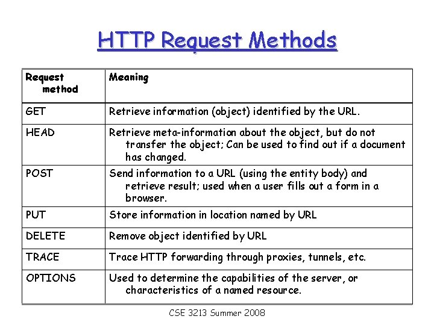
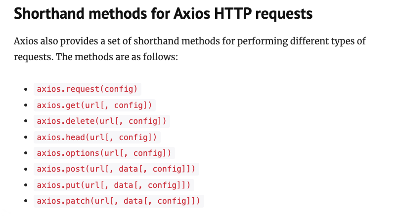
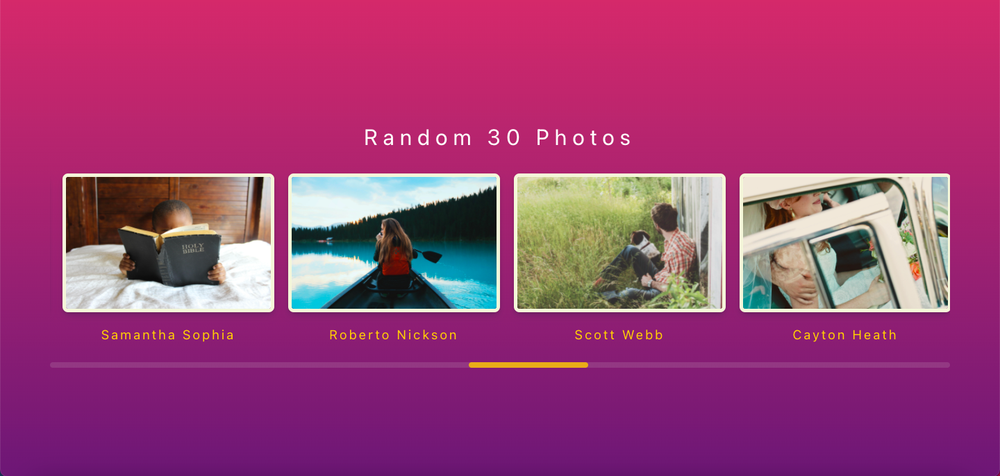

## HTTP Requests
 An application can `communicate with the outside world` using `HTTP requests`.
 - For example, if you want to get real time weather data in your application, you will need to make an HTTP request.
- You need to specify the URL you want to make a request to. You will fire the request with some data and you will get back the expected response.
- For example, to get weather information, you will send the location for which you want the weather information. In response, you will get back the expected weather information.

### HTTP Request Methods Summery:


### 1- Fetch:
Fetch is a built-in API for making HTTP Requests.
- Fetch is built into most modern browsers; no installation is required as such.
- Fetch uses the body property.
- Fetch’s body has to be stringified.
- Fetch only supports Chrome 42+, Firefox 39+, Edge 14+, and Safari 10.1+ (This is known as Backward Compatibility).


### 2- Axios:
Axios is a Javascript library used to make HTTP requests for NodeJS.
- Axios is a stand-alone `third party package` that can be easily installed.
- It automatically transforms the response data to JSON object.
- It uses the data property.
- Axios has wide browser support.
- You can install it as a dependency from the Node Package Manager using the following command:
```js 
npm install axios
```
- to use axios, you need to import it first
```js 
import axios from 'axios'
```



  
## Practice Time (Fetch Random photos using picsum.photos API)




- Your app sturcture should look like this:

```
/photos-app
   /src
    /App.js
    /App.css
    /index.js
```

- create react app using the command:

```js
npx create-react-app@latest photos-app
```

- use styled component for styling using the command below:

```js
npm install --save styled-components
```

- `App.js`
```js
import { useState, useEffect } from "react";
import axios from "axios";
import styled from "styled-components";
import "./App.css";

const Container = styled.div`
  background: #642b73; /* fallback for old browsers */
  background: -webkit-linear-gradient(
    to right,
    #c6426e,
    #642b73
  ); /* Chrome 10-25, Safari 5.1-6 */
  background: linear-gradient(
    to bottom,
    #c6426e,
    #642b73
  ); /* W3C, IE 10+/ Edge, Firefox 16+, Chrome 26+, Opera 12+, Safari 7+ */

  height: 100vh;
  display: flex;
  flex-direction: column;
  justify-content: center;
  align-items: center;
`;

const Title = styled.h1`
  font-weight: 400;
  letter-spacing: 0.5rem;
  margin-bottom: 1.5rem;
  color: rgb(255, 255, 255);
`;

const ImageSlider = styled.div`
  padding: 10px 0;
  display: flex;
  flex-direction: row;
  align-items: center;
  justify-content: flex-start;
  overflow-x: scroll;
  width: 90%;
`;
const Wrapper = styled.div`
  height: 100%;
  display: flex;
  transition: all 1.5s ease;
  transform: translateX(${(props) => props.slideIndex * 100}vw);
`;

const ImageContainer = styled.div`
  margin: 0px 10px;
`;
const Image = styled.img`
  height: 200px;
  width: 305px;
  border-radius: 0.5rem;
  border: 5px solid beige;
  box-shadow: rgba(50, 50, 93, 0.25) 0px 6px 12px -2px,
    rgba(0, 0, 0, 0.3) 0px 3px 7px -3px;
`;

const Text = styled.h3`
  color: rgb(255, 205, 6);
  text-align: center;
  font-weight: 400;
  letter-spacing: 0.2rem;
`;

function App() {
  const [photos, setPhotos] = useState([]);

  useEffect(() => {
    fetchPhotos();
  }, []);

  const fetchPhotos = () => {
    // axios
    //   .get("https://picsum.photos/v2/list")
    //   .then((res) => {
    //     setPhotos(res.data);
    //     console.log(res.data);
    //   })
    //   .catch((err) => console.log(err));

    fetch("https://picsum.photos/v2/list")
    .then(res => res.json())
    .then(res =>{
      console.log(res)
      setPhotos(res)
    })
    .catch(err => console.log(err))
  };

  return (
    <div className="App">
      <Container>
        <Title>Random 30 Photos</Title>
        <ImageSlider>
          <Wrapper>
            {photos.map((photo) => (
              <ImageContainer key={photo.id}>
                <Image src={photo.download_url} />
                <Text>{photo.author}</Text>
              </ImageContainer>
            ))}
          </Wrapper>
        </ImageSlider>
      </Container>
    </div>
  );
}

export default App;

```

- `App.css`
```css
*{
  box-sizing: border-box;
}

::-webkit-scrollbar {
  width: 0.5px;
  height: 8px;
}
  ::-webkit-scrollbar-track {
  background: #e3dcdc25; 
  border-radius:10px;
}
  ::-webkit-scrollbar-thumb {
  background: rgba(255, 205, 6, 0.755); 
  border-radius:10px;
}
::-webkit-scrollbar-thumb:hover {
  
  background:  rgb(255, 206, 9); 
} 
```

## Homework (Optional)

Make a react app with the following requirements:
- Use Context API for state management
- Use any of the public APIs to fetch data
- Minimum css
- Use npm packages needed to help you

<hr>

Additional Resources:
- [Public API ](https://github.com/public-apis/public-apis)
- [Styled Components ](https://styled-components.com/)
- [picsum.photos API](https://picsum.photos/)
- [Fetch API Article](https://medium.com/@9cv9official/what-are-get-post-put-patch-delete-a-walkthrough-with-javascripts-fetch-api-17be31755d28)

- [uigradients](https://uigradients.com/#CrimsonTide)
- [css box shadow](https://getcssscan.com/css-box-shadow-examples)


