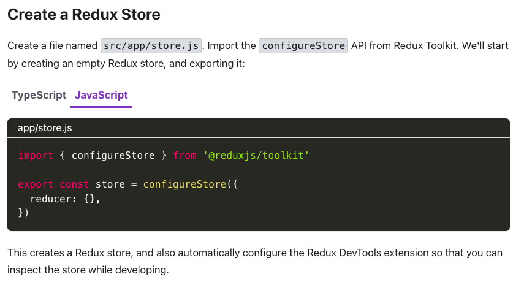
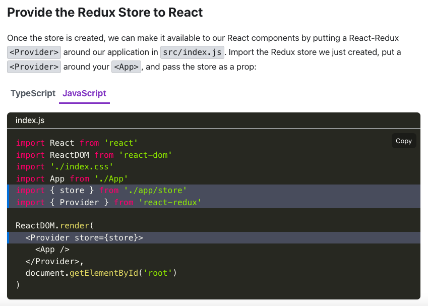
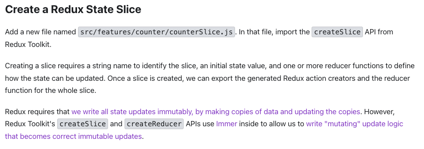
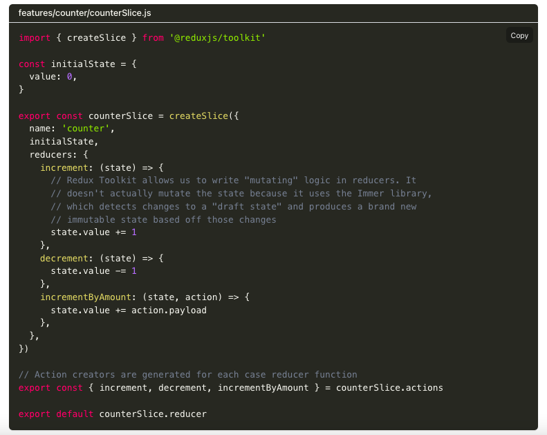
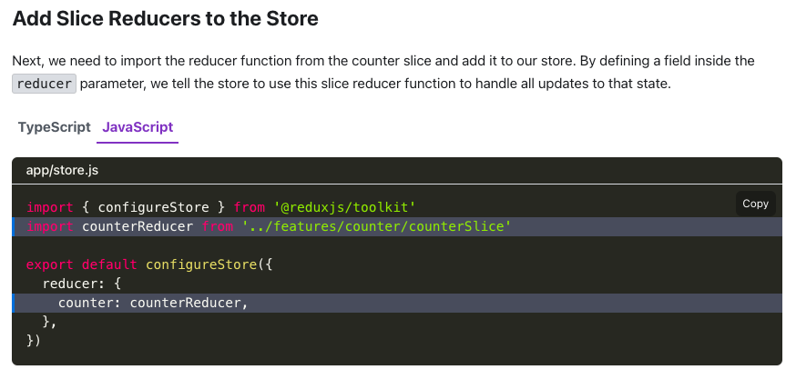
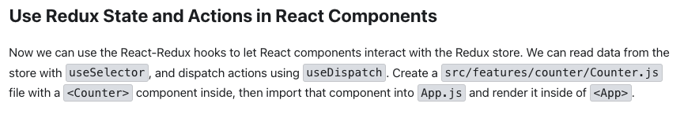
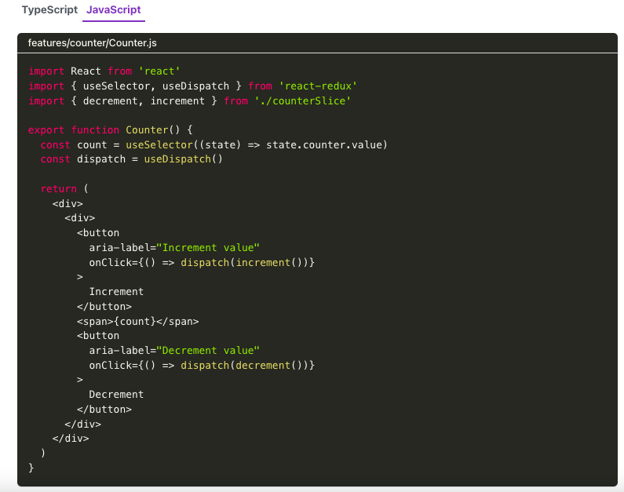

# Introduction to Redux Toolkit

## What is Redux?
`Redux` is a `pattern and library for managing and updating application state`, using events called `"actions"`. It serves as a `centralized store for state` that needs to be used across your `entire application`, with rules ensuring that the state can only be updated in a predictable fashion.

## Why Should I Use Redux?
Redux helps you manage `"global" state` - state that is needed across many parts of your application.


## When Should I Use Redux?
Redux is more useful when:

 - You have large amounts of application state that are needed in many places in the app.
 - The app state is updated frequently over time
 - The logic to update that state may be complex
 - The app has a medium or large-sized codebase, and might be worked on by many people.


## Redux Libraries and Tools:
 - React-Redux
 - `Redux Toolkit`: is the recommended approach for writing Redux logic. It contains packages and functions that we think are essential for building a Redux app. Redux Toolkit builds in our suggested best practices, simplifies most Redux tasks, prevents common mistakes, and makes it easier to write Redux applications.
 - Redux DevTools Extension:
 shows a history of the changes to the state in your Redux store over time

 ## Redux Terminology:

  ### 1- Actions:
 You can think of an `action` as an `event that describes something that happened in the application`.

 ### 2- Reducers:
 You can think of a `reducer` as an `event listener which handles events based on the received action (event) type`
 - A reducer is a function that receives the current `state` and an `action object`

  ### 3- Store:
 A `"store"` is a container/object that holds your application's global state.
 - The store is created by passing in a reducer/reducers.

 ### 4- Dispatch:
 The only way to update the state is to call the dispatch() and pass in an action with the payload if needed.

 ### 5- Selectors:
 Selectors are `functions` that know how `to extract specific pieces of information from a store state value`. 


## Modern Redux with Redux Toolkit
### Purpose:
The `Redux Toolkit package` is intended to be the `standard way to write Redux logic`. It was originally created to help address three common concerns about Redux:

 - "Configuring a Redux store is too complicated"
 - "I have to add a lot of packages to get Redux to do anything useful"
 - "Redux requires too much boilerplate code"

### Installation:
 ```js
  npm install @reduxjs/toolkit react-redux
  ```











<hr>

Additional Resources:
- [Redux Toolkit](https://redux-toolkit.js.org/tutorials/quick-start)


